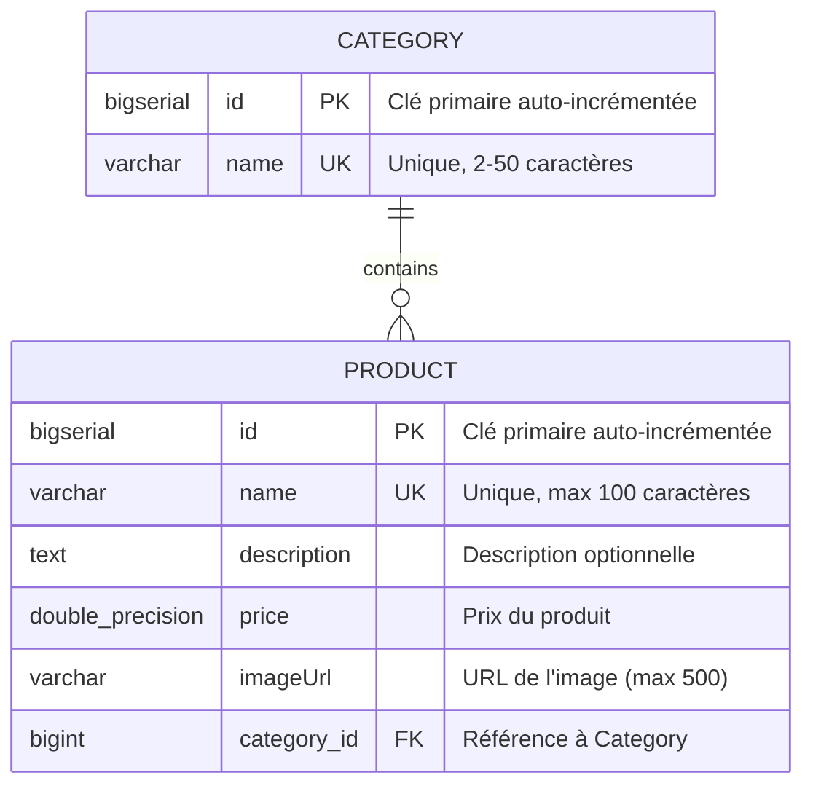
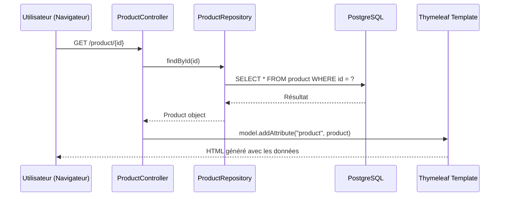
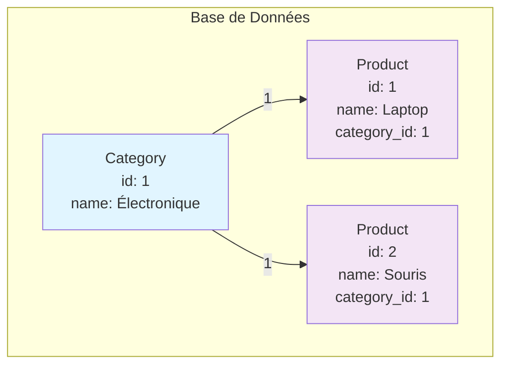

# 📚 Introduction à Spring MVC avec PostgreSQL

**Bienvenue !** Ce projet est un exemple pédagogique pour apprendre les concepts fondamentaux de **Spring MVC** et **JPA/Hibernate** avec une base de données PostgreSQL.

---

## 🎯 Objectifs d'apprentissage

Ce projet vous enseignera :
- ✅ **Entités JPA** : Comment modéliser des données avec des annotations Hibernate
- ✅ **Relationnel** : Comment créer des relations entre tables (One-to-Many)
- ✅ **Repositories** : Accéder à la BD via Spring Data JPA
- ✅ **Controllers MVC** : Gérer les requêtes HTTP et répondre avec des vues
- ✅ **Validation** : Valider les données côté application ET côté BD
- ✅ **Thymeleaf** : Moteur de templates pour générer du HTML dynamique

---

## 🗄️ Architecture de la Base de Données

### Diagramme Entité-Relation



### Explication des concepts

#### **Entité Category**
```java
@Entity  // Cette classe représente une table en BD
public class Category {
    @Id @GeneratedValue(strategy = GenerationType.IDENTITY)
    private Long id;  // Clé primaire, auto-incrémentée
    
    @Column(
        unique = true,           // UNIQUE en BD
        nullable = false,        // NOT NULL en BD
        columnDefinition = "VARCHAR(50) CHECK (LENGTH(name) >= 2 AND LENGTH(name) <= 50)"
    )
    private String name;         // Contrainte CHECK en BD
}
```

**Vocabulaire :**
- **@Entity** : Annotation qui dit à JPA de créer une table pour cette classe
- **@Id** : Marque le champ comme clé primaire
- **@GeneratedValue** : Auto-incrémente l'ID
- **unique = true** : SQL → `UNIQUE` (pas de doublons)
- **nullable = false** : SQL → `NOT NULL` (obligatoire)
- **CHECK** : Contrainte BD qui valide les données avant insertion

---

#### **Entité Product**
```java
@Entity
public class Product {
    @Id @GeneratedValue(strategy = GenerationType.IDENTITY)
    private Long id;
    
    @Column(nullable = false, unique = true, length = 100)
    private String name;
    
    @Column
    private String description;
    
    @Column(nullable = false)
    private Double price;
    
    // Relation One-to-Many avec Category
    @ManyToOne(fetch = FetchType.EAGER, cascade = { CascadeType.MERGE })
    @JoinColumn(name = "category_id")
    private Category category;
}
```

**Concepts clés :**
- **@ManyToOne** : Plusieurs produits peuvent appartenir à une seule catégorie
- **@JoinColumn** : Crée la clé étrangère `category_id` en BD
- **FetchType.EAGER** : Charge la catégorie automatiquement avec le produit
- **CascadeType.MERGE** : Si on met à jour une catégorie, les produits liés sont aussi mis à jour

---

## 🔄 Flux d'une requête Spring MVC



**Étapes :**
1. **Request** : L'utilisateur clique sur un lien → requête HTTP
2. **Controller** : `ProductController` reçoit la requête
3. **Repository** : Demande les données à la BD
4. **Database** : PostgreSQL cherche et retourne les données
5. **Response** : Thymeleaf génère du HTML avec les données et renvoie au navigateur

---

## 📁 Structure du projet

```
src/main/java/be/bstorm/tf_java_2026_introspringmvc/
├── entities/              ← 🗂️ Les classes qui représentent les tables
│   ├── Category.java
│   └── Product.java
│
├── repositories/          ← 🔍 Accès à la base de données
│   ├── CategoryRepository.java
│   └── ProductRepository.java
│
├── controllers/           ← 🎮 Gestion des requêtes HTTP
│   ├── HomeController.java
│   └── ProductController.java
│
└── models/               ← 📋 Objets pour filtrer/valider
    └── ProductFilter.java
```

---

## 🔗 Exemple de relation One-to-Many



**En code Java :**
```java
Category electronics = categoryRepository.findById(1L).get();
List<Product> productsInElectronics = productRepository.findAll()
    .stream()
    .filter(p -> p.getCategory().getId().equals(1L))
    .toList();
```

---

## 🚀 Démarrer le projet

### Prérequis
- Java 25+
- Maven
- PostgreSQL

### Configuration
Créez un fichier `application.properties` dans `src/main/resources/` :
```properties
spring.application.name=TfJava2026IntroSpringMvc
spring.jpa.hibernate.ddl-auto=update
spring.datasource.url=jdbc:postgresql://localhost:5432/tf_mvc_db
spring.datasource.username=postgres
spring.datasource.password=your_password
spring.datasource.driver-class-name=org.postgresql.Driver
spring.jpa.database-platform=org.hibernate.dialect.PostgreSQLDialect
```

### Lancer l'application
```bash
mvn spring-boot:run
```

Puis ouvrez : `http://localhost:8080`

---

## 📚 Concepts expliqués

### JPA (Java Persistence API)
Abstraction pour accéder à une BD sans écrire de SQL brut. Hibernate est l'implémentation de JPA utilisée par Spring.

### Repository Pattern
Permet de dire : *"Donne-moi un objet sans que je sais comment tu l'accèdes"*
```java
@Repository
public interface ProductRepository extends JpaRepository<Product, Long> {
    // JpaRepository fournit findAll(), findById(), save(), delete()...
    // C'est du CRUD automatique ! ✨
}
```

### MVC (Model-View-Controller)
```
Model     ← Données (entités, objets)
View      ← Affichage (templates Thymeleaf)
Controller ← Logique (traitement des requêtes)
```

### Annotations importantes
| Annotation | Rôle |
|-----------|------|
| `@Entity` | Classe = Table BD |
| `@Id` | Clé primaire |
| `@GeneratedValue` | Auto-incrémente |
| `@Column` | Configuration de colonne |
| `@ManyToOne` | Relation N→1 |
| `@JoinColumn` | Clé étrangère |
| `@Controller` | Classe = Gestionnaire de requêtes |
| `@RequestMapping` | Route HTTP |
| `@GetMapping` / `@PostMapping` | GET / POST HTTP |

---

## 🎓 Exercices pour apprendre

### 1. Ajouter une validation
Modifiez `Product.java` pour ajouter une validation sur le prix :
```java
@Column(nullable = false)
@Min(value = 0, message = "Le prix doit être >= 0")
private Double price;
```

### 2. Créer une nouvelle entité
Créez une entité `Author` et liez-la à `Category` (One-to-Many).

### 3. Ajouter une méthode au Repository
```java
public interface ProductRepository extends JpaRepository<Product, Long> {
    List<Product> findByPriceGreaterThan(Double price);
}
```

### 4. Créer un contrôleur
Créez `CategoryController` avec les routes `/category` (lister) et `/category/create` (ajouter).

---

## 📖 Ressources supplémentaires
- [Spring Boot Documentation](https://spring.io/projects/spring-boot)
- [JPA/Hibernate Guide](https://docs.jboss.org/hibernate/orm/6.0/userguide/html_single/)
- [Thymeleaf Tutorial](https://www.thymeleaf.org/doc/tutorials/3.0/usingthymeleaf.html)

---

**Happy Learning! 🚀**
