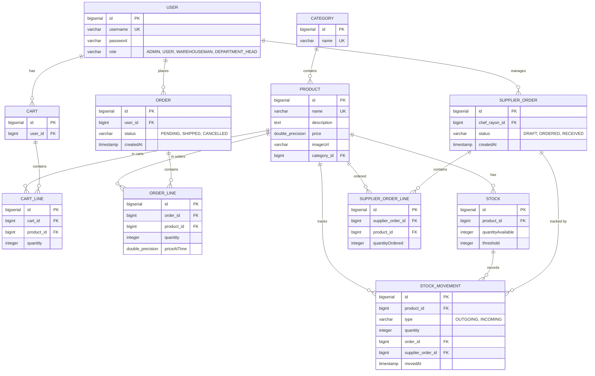
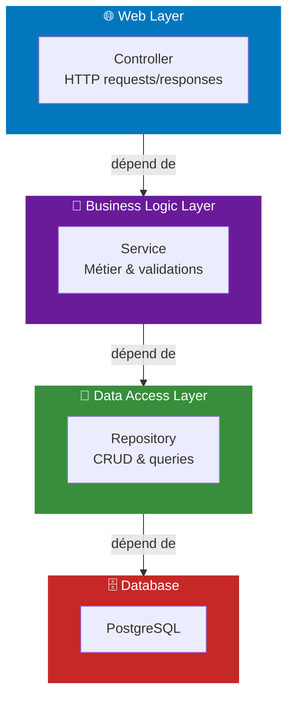
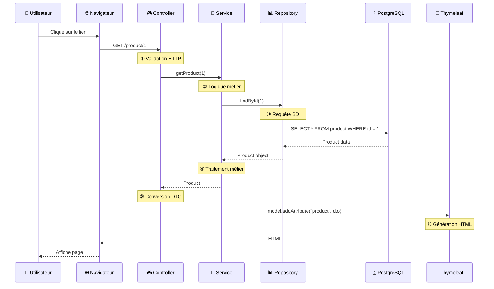

# 📚 Introduction à Spring MVC avec PostgreSQL

**Bienvenue !** Ce projet est un exemple pédagogique complet pour apprendre les concepts fondamentaux de **Spring MVC**, **Spring Security**, **JPA/Hibernate** avancé, et **architecture en couches** avec une base de données PostgreSQL.

---

## 🎯 Objectifs d'apprentissage

Ce projet vous enseignera :
- ✅ **Controllers MVC** : Gérer les requêtes HTTP et répondre avec des vues
- ✅ **DTOs** : Séparer les données web des entités BD avec MapStruct
- ✅ **Services** : Implémenter la logique métier et garantir la cohérence du code
- ✅ **JPA/Hibernate** : Modéliser les données avec des relations complexes, héritage, et embeddables
- ✅ **Repositories** : Accéder à la BD via Spring Data JPA
- ✅ **Spring Security** : Authentification, autorisation, et protection des routes
- ✅ **Thymeleaf** : Moteur de templates pour générer du HTML dynamique
- ✅ **Validation** : Valider les données côté application ET côté BD
- ✅ **Architecture en couches** : Séparer HTTP, logique métier, et accès données

---

## 📖 Documentation Pédagogique

### 🎮 Controllers & Routes
**Fichier** : `supports/01_Controllers.md`

Apprenez comment gérer les requêtes HTTP, retourner des vues, et structurer vos routes avec Spring MVC.

### 🗄️ JPA & Base de Données
**Fichier** : `supports/02_JPA.md`

Couverture complète de JPA :
- Entités et annotations fondamentales
- Relations (One-to-Many, Many-to-Many, etc.)
- **Héritage et MappedSuperclass**
- **Embeddable et objets composites**
- Stratégies d'héritage (TABLE_PER_CLASS, SINGLE_TABLE, JOINED)
- Clés composées avec @EmbeddedId
- Exercices pratiques progressifs

### 📦 DTOs & Mappers
**Fichier** : `supports/03_DTO.md`

Comprendre et implémenter le pattern DTO :
- **Pourquoi** séparer les entités des données web
- **3 cas d'usage** : Output DTOs, Input/Form DTOs, Query DTOs
- Stratégies de mapping : static methods, dedicated Mappers, MapStruct
- Automatiser le mapping avec **MapStruct**
- Exemples concrets du projet

### 🎯 Services & Logique Métier
**Fichier** : `supports/04_Services.md`

Apprendre l'importance de la couche Service :
- **Pourquoi** une couche métier est essentielle
- **Responsabilités** de chaque couche (Controller, Service, Repository)
- **Architecture en couches** et dépendances correctes
- **Cohérence du code** : utiliser des Services partout
- Cas d'usage pratiques et patterns

### 🔐 Spring Security
**Fichier** : `supports/05_Security.md`

Protéger votre application avec Spring Security :
- Authentification vs Autorisation
- **UserDetails, UserDetailsService, SecurityConfig** (setup une fois)
- Flux complet de login/logout
- États d'utilisateur : anonymous, authenticated, hasAuthority
- **@PreAuthorize** et **@AuthenticationPrincipal** (utilisation partout)
- Gestion des sessions et BCrypt

---

## 📝 Exercices Progressifs

### Exercice 1 : Gestion du Panier (Cart)
**Fichier** : `exercices/GestionPanier.md`

Apprenez les bases :
- Créer des entités avec relations
- Gérer un panier d'achat pour un utilisateur
- Ajouter/modifier/supprimer des articles
- Afficher les totaux

### Exercice 2 : Flux d'une Commande
**Fichier** : `exercices/FluxCommande.md`

Apprenez l'architecture complète :
- Transformer un panier validé en commande
- Implémenter des rôles (Magasinier, Chef de rayon)
- Gestion des stocks avec mouvements
- Flux multi-étape : validation → expédition → réception fournisseur
- Création automatique de commandes fournisseur

---

## 🗄️ Architecture de la Base de Données

### Diagramme Entité-Relation Complet



### Concepts Clés de l'Architecture

#### **Couches de l'Application**



---

## 📁 Structure du projet

```
src/main/java/be/bstorm/tf_java_2026_introspringmvc/
├── entities/              ← 🗂️ Les classes qui représentent les tables
│   ├── BaseEntity.java           (MappedSuperclass)
│   ├── User.java                 (implements UserDetails)
│   ├── Address.java              (Embeddable)
│   ├── Category.java
│   ├── Product.java
│   ├── Stock.java
│   ├── Cart.java
│   ├── CartLine.java             (Composite Key)
│   ├── Order.java                (TABLE_PER_CLASS inheritance)
│   ├── OrderLine.java
│   ├── SupplierOrder.java
│   ├── SupplierOrderLine.java
│   └── StockMovement.java
│
├── repositories/          ← 🔍 Accès à la base de données
│   ├── UserRepository.java
│   ├── CategoryRepository.java
│   ├── ProductRepository.java
│   ├── CartRepository.java
│   ├── OrderRepository.java
│   ├── SupplierOrderRepository.java
│   └── StockMovementRepository.java
│
├── services/              ← 🎯 Logique métier
│   ├── AuthService.java          (implements UserDetailsService)
│   └── CartService.java
│
├── controllers/           ← 🎮 Gestion des requêtes HTTP
│   ├── HomeController.java
│   ├── ProductController.java
│   ├── CartController.java
│   ├── OrderController.java
│   └── SupplierOrderController.java
│
├── config/                ← ⚙️ Configuration
│   └── SecurityConfig.java       (Spring Security)
│
├── dtos/                  ← 📦 Data Transfer Objects
│   ├── ProductIndexDto.java      (Output)
│   ├── ProductForm.java          (Input)
│   ├── ProductFilter.java        (Query)
│   └── CategoryDto.java
│
└── mappers/               ← 🔄 Conversion Entity ↔ DTO
    └── ProductMapper.java        (ou MapStruct generated)

supports/                 ← 📖 Documentation pédagogique
├── 01_Controllers.md
├── 02_JPA.md
├── 03_DTO.md
├── 04_Services.md
└── 05_Security.md

exercices/                ← 🏋️ Exercices progressifs
├── GestionPanier.md
└── FluxCommande.md
```

## 🔄 Flux d'une requête (Architecture complète)



---

### Prérequis
- Java 25+
- Maven
- PostgreSQL

### Configuration
Créez un fichier `application.properties` dans `src/main/resources/` :
```properties
spring.application.name=TfJava2026IntroSpringMvc
spring.jpa.hibernate.ddl-auto=update
spring.datasource.url=jdbc:postgresql://localhost:5432/tf_mvc_db
spring.datasource.username=postgres
spring.datasource.password=your_password
spring.datasource.driver-class-name=org.postgresql.Driver
spring.jpa.database-platform=org.hibernate.dialect.PostgreSQLDialect
```

### Lancer l'application
```bash
mvn spring-boot:run
```

Puis ouvrez : `http://localhost:8080`

---

## 🚀 Comment utiliser ce projet pédagogique

### 📖 Parcours recommandé d'apprentissage

**Semaine 1-2 : Fondamentaux**
1. Lire `supports/01_Controllers.md` et `supports/02_JPA.md` (sections fondamentales)
2. Faire l'**Exercice 1** : `exercices/GestionPanier.md`
3. Comprendre les relations JPA (One-to-Many, Many-to-Many)

**Semaine 3 : Patterns avancés**
4. Lire `supports/03_DTO.md` (conversion de données)
5. Lire `supports/04_Services.md` (architecture en couches)
6. Refactoriser le code du panier avec un Service

**Semaine 4 : Sécurité et flux complet**
7. Lire `supports/05_Security.md` (authentification/autorisation)
8. Ajouter Spring Security au projet
9. Faire l'**Exercice 2** : `exercices/FluxCommande.md` (architecture complète)

**Semaine 5+ : Approfondissement JPA**
10. Lire `supports/02_JPA.md` (sections avancées : MappedSuperclass, Embeddable, héritage)
11. Implémenter les concepts avancés dans FluxCommande

---

## 📚 Concepts clés explained

### 🏗️ Architecture en couches : Pourquoi ?

**Sans Service** : Logique partout (Controller, Repository, Utils)
- ❌ Code dupliqué (Web + API REST + Batch)
- ❌ Difficile à tester
- ❌ Incohérent et désorganisé

**Avec Service** : Une seule place pour la logique métier
- ✅ Réutilisable partout
- ✅ Facile à tester
- ✅ Clair et maintenable

### 📦 DTO : Pourquoi séparer les données ?

```
Entity (BD) ← DTO → Client
```

**Sans DTO** : Retourner l'entité directement
- ❌ Fuite de données sensibles
- ❌ Couplage fort avec la BD
- ❌ Consommation réseau inutile

**Avec DTO** : Mapper les données
- ✅ Contrôle total sur ce qu'on expose
- ✅ Découplage web/BD
- ✅ Optimisation des performances

### 🔐 Spring Security : Authentification vs Autorisation

| Concept | Signification | Exemple |
|---------|---|---|
| **Authentification** | Qui êtes-vous ? | Login avec username/password |
| **Autorisation** | Qu'avez-vous le droit de faire ? | @PreAuthorize("hasAuthority('ADMIN')") |

**Setup une fois** (au démarrage) :
- Implémenter UserDetails
- Implémenter UserDetailsService
- Configurer SecurityConfig

**Utiliser partout** (dans le code) :
- `@PreAuthorize` sur les méthodes
- `@AuthenticationPrincipal` pour l'utilisateur

### 🗄️ JPA Avancé : Concepts modernes

| Concept | Utilisation |
|---------|-------------|
| **@MappedSuperclass** | Partager des colonnes communes (id, createdAt) |
| **@Embeddable** | Regrouper des colonnes liées (Address : rue, ville, codePostal) |
| **TABLE_PER_CLASS** | Héritage : chaque classe a sa propre table |
| **@EmbeddedId** | Clés composées (cart_id + product_id = id unique) |
| **ManyToMany** | Relations bidirectionnelles (Product ↔ Category) |

---

## 📚 Annotations essentielles

### Entités
| Annotation | Rôle |
|-----------|------|
| `@Entity` | Classe = Table BD |
| `@Table(name="...")` | Personnaliser le nom de la table |
| `@Id` | Clé primaire |
| `@GeneratedValue` | Auto-incrémente |
| `@Column` | Configuration de colonne |
| `@Embeddable` | Classe = Colonne composite |
| `@EmbeddedId` | Clé composite |
| `@MappedSuperclass` | Classe abstraite pour héritage |

### Relations
| Annotation | Signification |
|-----------|---|
| `@ManyToOne` | N→1 (plusieurs produits, une catégorie) |
| `@OneToMany` | 1→N (une catégorie, plusieurs produits) |
| `@ManyToMany` | N↔N (produits ↔ catégories) |
| `@JoinColumn` | Clé étrangère |
| `@JoinTable` | Table d'association (Many-to-Many) |

### Web & Sécurité
| Annotation | Rôle |
|-----------|------|
| `@Controller` | Classe = Gestionnaire de requêtes |
| `@Service` | Classe = Logique métier |
| `@Repository` | Classe = Accès données |
| `@RequestMapping` | Route HTTP |
| `@GetMapping` / `@PostMapping` | GET / POST HTTP |
| `@PreAuthorize` | Vérifier les permissions |
| `@AuthenticationPrincipal` | Injecter l'utilisateur connecté |

### DTO & Validation
| Annotation | Rôle |
|-----------|------|
| `@Valid` | Valider un objet |
| `@NotBlank` | Champ requis |
| `@Min` / `@Max` | Contraintes numériques |
| `@Email` | Format email |
| `@Length` | Longueur de chaîne |

---

## 🔗 Ressources supplémentaires

- [Spring Boot Documentation](https://spring.io/projects/spring-boot)
- [Spring Data JPA](https://spring.io/projects/spring-data-jpa)
- [Spring Security](https://spring.io/projects/spring-security)
- [Thymeleaf](https://www.thymeleaf.org/)
- [MapStruct](https://mapstruct.org/)

---

## 💡 Points clés à retenir

✅ **Couches** : Séparer HTTP → Métier → Données (TOUJOURS)
✅ **DTOs** : Mapper les entités pour le web (contrôle + sécurité)
✅ **Services** : Une place unique pour la logique (réutilisabilité)
✅ **Security** : Setup une fois, utiliser partout avec @PreAuthorize
✅ **JPA** : Relations, héritage, embeddables pour modéliser correctement

---

**Bon apprentissage ! 🚀**