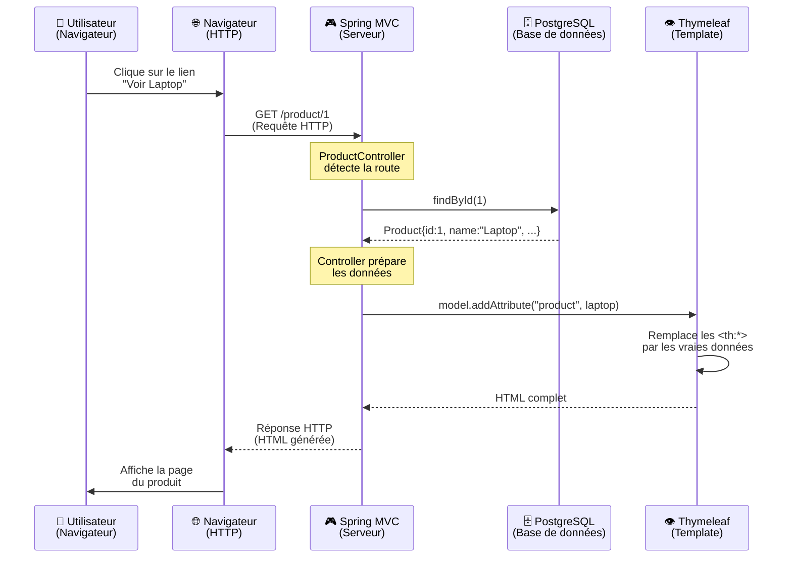

# 🎮 Les Controllers en Spring MVC - Cours Complet

Un guide pour maîtriser **les fondations du web en Spring MVC**.

---

## 📋 Table des matières
1. [Concepts fondamentaux](#concepts)
2. [Architecture MVC](#architecture)
3. [Flux d'une requête web](#flux)
4. [Les Controllers](#controllers)
5. [Recevoir des données (3 méthodes)](#recevoir)
6. [Envoyer des réponses](#envoyer)
7. [Thymeleaf](#thymeleaf)
8. [Exercices pratiques](#exercices)

---

## 📚 Concepts fondamentaux {#concepts}

### C'est quoi, le web ?
Le web fonctionne sur un modèle **Client-Serveur** simple :

```
Navigateur (Client)
     ↓ "Je veux la page /product/1"
     ↓ (Requête HTTP)
Serveur Spring
     ↓ "Voici le produit n°1 en HTML"
     ↓ (Réponse HTTP)
Navigateur (affiche la page)
```

### Les verbes HTTP essentiels

| Verbe | Utilité | Exemple |
|-------|---------|---------|
| **GET** | Récupérer des données | `GET /product/1` → voir le produit |
| **POST** | Créer/modifier des données | `POST /product` → ajouter un produit |
| **PUT** | Remplacer complètement | Rarement utilisé en web classique |
| **DELETE** | Supprimer des données | `DELETE /product/1` → supprimer le produit |

**Règle d'or** : GET doit être **sûr** (pas de modification), POST **modifie** les données.

---

## 🏗️ Architecture MVC {#architecture}

MVC = **Model View Controller**

```
┌─────────────────────────────────────────────────┐
│            APPLICATION SPRING MVC               │
├─────────────────────────────────────────────────┤
│                                                 │
│  REQUEST HTTP                                   │
│  ↓                                              │
│  🎮 CONTROLLER (ProductController)              │
│     ├─ Traite la requête                        │
│     ├─ Appelle les repositories/services        │
│     └─ Prépare les données                      │
│  ↓                                              │
│  📊 MODEL (Données)                             │
│     ├─ Product, Category (entités)              │
│     └─ Objets Java avec les données             │
│  ↓                                              │
│  👁️ VIEW (Template Thymeleaf)                   │
│     ├─ Affiche les données du Model             │
│     └─ Génère du HTML                           │
│  ↓                                              │
│  RESPONSE HTML → Navigateur                     │
│                                                 │
└─────────────────────────────────────────────────┘
```

---

## 🔄 Flux d'une requête web {#flux}

### Étape par étape (avec un exemple réel)

**Scenario** : L'utilisateur clique sur "Voir le produit Laptop"



---

## 🎮 Les Controllers {#controllers}

### Qu'est-ce qu'un Controller ?
Un **Controller** est une classe Java qui :
- ✅ Écoute les requêtes HTTP
- ✅ Récupère les données de la BD
- ✅ Prépare les données pour l'affichage
- ✅ Retourne une vue (template HTML)

### Structure basique

```java
@Controller                    // ← Dit à Spring "Je suis un gestionnaire de requêtes"
@RequestMapping("/product")    // ← Toutes mes routes commencent par /product
@RequiredArgsConstructor       // ← Lombok génère le constructeur des dépendances
public class ProductController {

    private final ProductRepository productRepository;  // ← Injection de dépendance
    
    @GetMapping("/{id}")       // ← Route : GET /product/1, /product/2, etc.
    public String details(
            @PathVariable Long id,    // ← Variable de la route
            Model model               // ← Conteneur pour envoyer des données
    ) {
        Product product = productRepository.findById(id)
                .orElseThrow();       // ← Si pas trouvé, exception
        
        model.addAttribute("product", product);  // ← Envoyer au template
        
        return "product/details";     // ← Nom du template Thymeleaf
    }
}
```

---

## 📥 Recevoir des données {#recevoir}

### 3 façons de recevoir des infos d'une requête HTTP

#### 1️⃣ **PathVariable** - Données dans l'URL elle-même

**Utilisation** : Quand l'ID/l'identifiant fait partie de la URL.

```java
@GetMapping("/{id}")
public String details(
    @PathVariable Long id   // ← Récupère le {id} de la route
) {
    // id = 1 si on accède à /product/1
    // id = 42 si on accède à /product/42
}
```

**Route** : `GET /product/1`
```
      ↑ verbe HTTP
               ↑ Controller + path
                      ↑ PathVariable {id} = 1
```

**Cas d'usage** : Afficher UN produit, modifier UN produit, supprimer UN produit.

---

#### 2️⃣ **RequestParam** - Données dans la query string (après le ?)

**Utilisation** : Quand on veut filtrer, paginer, ou passer des paramètres optionnels.

```java
@GetMapping("/search")
public String search(
    @RequestParam(required = false) String name,        // Optionnel
    @RequestParam(required = false) Double minPrice,    // Optionnel
    @RequestParam(defaultValue = "0") Integer page      // Défaut = 0
) {
    // Si on accède à /product/search?name=Laptop&minPrice=500&page=2
    // name = "Laptop"
    // minPrice = 500.0
    // page = 2
}
```

**Route** : `GET /product/search?name=Laptop&minPrice=500&page=2`
```
    ↑ verbe HTTP
             ↑ Controller + path
                   ↑ RequestParams (après le ?)
```

**Format** : `?clé1=valeur1&clé2=valeur2`

**Cas d'usage** : Filtrer une liste, chercher, paginer, trier.

---

#### 3️⃣ **ModelAttribute** - Données d'un formulaire HTML

**Utilisation** : Quand un formulaire POST envoie des données et on veut les mapper automatiquement sur un objet Java.

```java
// GET - Afficher le formulaire vide
@GetMapping("/create")
public String create(Model model) {
    model.addAttribute("product", new Product());
    return "product/create";
}

// POST - Traiter le formulaire
@PostMapping("/create")
public String create(
    @ModelAttribute Product product,  // ← Spring récupère les données du formulaire
    BindingResult bindingResult       // ← Erreurs de validation
) {
    if (bindingResult.hasErrors()) {
        return "product/create";      // Réafficher le formulaire avec erreurs
    }
    
    productRepository.save(product);  // Sauvegarder en BD
    return "redirect:/product";       // Rediriger vers la liste
}
```

**Template HTML** (`product/create.html`) :
```html
<form method="POST" th:action="@{/product/create}">
    <input type="text" name="name" th:value="${product.name}" />
    <!-- Spring fait : product.setName(formulaire.name) -->
    
    <input type="number" name="price" th:value="${product.price}" />
    <!-- Spring fait : product.setPrice(formulaire.price) -->
    
    <button type="submit">Créer</button>
</form>
```

**Flux du formulaire** :
```
Utilisateur remplit le formulaire
        ↓
Clique sur "Créer"
        ↓
POST /product/create avec les données
        ↓
Spring mappe : 
  - name="Laptop" → product.setName("Laptop")
  - price="999" → product.setPrice(999.0)
        ↓
@PostMapping intercepte et récupère le Product rempli
        ↓
Validation + sauvegarde BD
        ↓
Redirection vers /product
```

---

### Comparaison des 3 méthodes

| Méthode | Format | Cas d'usage | Optionnel ? | Exemple |
|---------|--------|------------|-----------|---------|
| **PathVariable** | Dans l'URL | ID unique | ❌ Non | `GET /product/1` |
| **RequestParam** | Après le `?` | Filtres/pagination | ✅ Oui | `GET /search?name=Laptop` |
| **ModelAttribute** | Corps du POST | Formulaires | ❌ Non | `POST /product/create` (formulaire) |

---

## 📤 Envoyer des réponses {#envoyer}

### Le retour `String` du Controller

Le `return` d'une méthode Controller peut être :

#### Type 1 : **Chemin vers un template** (Affichage HTML)

```java
@GetMapping("/{id}")
public String details(@PathVariable Long id, Model model) {
    Product product = productRepository.findById(id).orElseThrow();
    model.addAttribute("product", product);
    
    return "product/details";  // ← Cherche le template : src/main/resources/templates/product/details.html
}
```

**Thymeleaf va** :
1. Chercher le fichier `src/main/resources/templates/product/details.html`
2. Remplacer les `${product.name}`, `${product.price}` par les vraies valeurs
3. Générer du HTML complet
4. Envoyer au navigateur

**Résultat au navigateur** : Le HTML de la page avec les données.

---

#### Type 2 : **Redirection** (Aller vers une autre URL)

```java
@PostMapping("/create")
public String create(@ModelAttribute Product product) {
    productRepository.save(product);
    
    return "redirect:/product";  // ← Redirection vers /product
}
```

**Flux** :
1. Utilisateur soumet un formulaire
2. Spring sauvegarde en BD
3. Spring **redéclenche** une requête GET `/product`
4. Le navigateur affiche la liste des produits

**Différence clé** :
- `return "product/list"` → **Affiche directement** le template
- `return "redirect:/product"` → **Redirection** vers une autre route

**Pourquoi rediriger ?**
Pour éviter que l'utilisateur soumette le formulaire deux fois s'il rafraîchit la page.

```
❌ Mauvais (sans redirection) :
POST /product/create
    ↓
Affiche la liste avec "Produit créé"
    ↓
Utilisateur clique F5 (refresh)
    ↓
POST /product/create RELANCÉ (crée le produit deux fois !)

✅ Bon (avec redirection) :
POST /product/create
    ↓
Redirection vers GET /product
    ↓
Affiche la liste avec "Produit créé"
    ↓
Utilisateur clique F5 (refresh)
    ↓
GET /product RELANCÉ (pas de création supplémentaire)
```

---

### L'objet `Model`

`Model` est un **conteneur** pour passer des données au template.

```java
Model model;  // Spring l'injecte automatiquement

// Ajouter des données
model.addAttribute("product", product);        // product = l'objet Product
model.addAttribute("message", "Bienvenue !");  // message = "Bienvenue !"
model.addAttribute("count", 42);               // count = 42

// Dans le template Thymeleaf, on peut les utiliser :
// ${product.name}
// ${message}
// ${count}
```

---

## 👁️ Thymeleaf - Moteur de templates {#thymeleaf}

### Qu'est-ce que Thymeleaf ?

**Thymeleaf** est un moteur de templates qui :
- ✅ Prend un fichier HTML avec des placeholders
- ✅ Remplace les placeholders par des vraies données
- ✅ Génère du HTML complet à envoyer au navigateur

### Structure d'un template

```html
<!-- src/main/resources/templates/product/details.html -->

<!DOCTYPE html>
<html xmlns:th="http://www.thymeleaf.org">
<head>
    <title th:text="${product.name}">Nom du produit</title>
    <!-- ↑ Remplace "Nom du produit" par la vraie valeur de product.name -->
</head>
<body>
    <h1 th:text="${product.name}">Titre</h1>
    <p th:text="${product.description}">Description</p>
    <p>Prix : <span th:text="${product.price}">0</span> €</p>
    
    <a th:href="@{/product}">Retour à la liste</a>
</body>
</html>
```

### Les attributs Thymeleaf courants

#### `th:text` - Afficher du texte

```html
<p th:text="${product.name}">Valeur par défaut</p>
```
- Remplace le contenu par la valeur
- La "Valeur par défaut" s'affiche en développement pour voir la structure

#### `th:href` - Lien dynamique

```html
<a th:href="@{/product/{id}(id=${product.id})}">Voir</a>
```
Génère : `<a href="/product/1">Voir</a>` (si id=1)

Syntaxe : `@{/chemin/(paramètre=${variable})}`

#### `th:each` - Boucler sur une liste

```html
<ul>
    <li th:each="product : ${products}" th:text="${product.name}">Produit</li>
</ul>
```

Si `products = [Laptop, Souris, Clavier]`, génère :
```html
<ul>
    <li>Laptop</li>
    <li>Souris</li>
    <li>Clavier</li>
</ul>
```

#### `th:if` / `th:unless` - Condition

```html
<p th:if="${product.price > 1000}">Produit premium</p>
<p th:unless="${product.description == null}">Description : <span th:text="${product.description}"></span></p>
```

#### `th:action` - Formulaire dynamique

```html
<form method="POST" th:action="@{/product/create}">
    <input type="text" name="name" />
    <button>Créer</button>
</form>
```

Génère :
```html
<form method="POST" action="/product/create">
    ...
</form>
```

---

### Exemple complet : Afficher un produit

**Controller** :
```java
@GetMapping("/{id}")
public String details(@PathVariable Long id, Model model) {
    Product product = productRepository.findById(id).orElseThrow();
    model.addAttribute("product", product);
    return "product/details";
}
```

**Template** (`product/details.html`) :
```html
<!DOCTYPE html>
<html xmlns:th="http://www.thymeleaf.org">
<head>
    <title th:text="${product.name}">Produit</title>
</head>
<body>
    <h1 th:text="${product.name}">Titre</h1>
    
    <p th:text="${product.description}">Description</p>
    <p>Prix : <strong th:text="${product.price}">0</strong> €</p>
    
    <a th:href="@{/}">Retour accueil</a>
</body>
</html>
```

**Rendu** (ce que le navigateur reçoit si product = {id:1, name:"Laptop", price:999}) :
```html
<!DOCTYPE html>
<html>
<head>
    <title>Laptop</title>
</head>
<body>
    <h1>Laptop</h1>
    
    <p>Un super ordinateur</p>
    <p>Prix : <strong>999</strong> €</p>
    
    <a href="/">Retour accueil</a>
</body>
</html>
```

---

## 📖 Résumé des flux

### GET - Afficher une page
```
1. Navigateur : GET /product/1
2. Spring : Route @GetMapping("/{id}")
3. Controller : Récupère le produit
4. Model : Ajoute le produit
5. Template : Génère du HTML
6. Navigateur : Affiche la page
```

### POST - Formulaire
```
1. Navigateur : Soumet formulaire
2. Spring : Route @PostMapping
3. Controller : Reçoit @ModelAttribute
4. BD : Sauvegarde
5. Spring : Redirection
6. Navigateur : Suit la redirection (GET)
7. Affichage : Nouvelle page
```

---

## ✨ À retenir

1. **PathVariable** = ID dans l'URL (`/product/1`)
2. **RequestParam** = Filtres après le `?` (`/search?name=Laptop`)
3. **ModelAttribute** = Données d'un formulaire (POST)
4. **Model** = Conteneur pour passer les données au template
5. **Template** = Thymeleaf génère du HTML dynamique
6. **Redirection** = Évite les envois de formulaire dupliqués
7. **th:each, th:if, th:text** = Logique dans les templates

---

**Vous êtes maintenant prêts à créer vos propres routes et pages ! 🚀**
