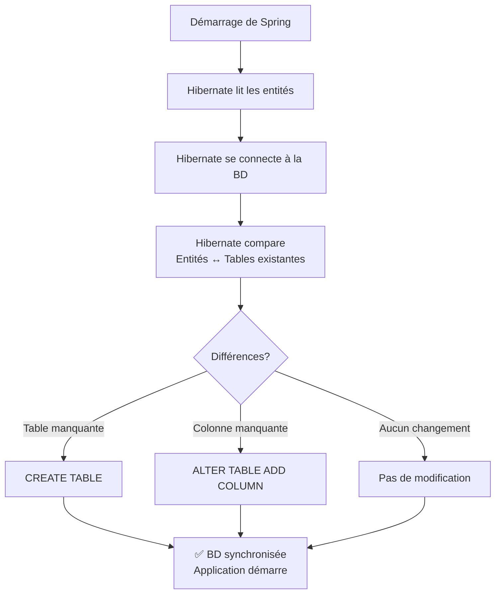
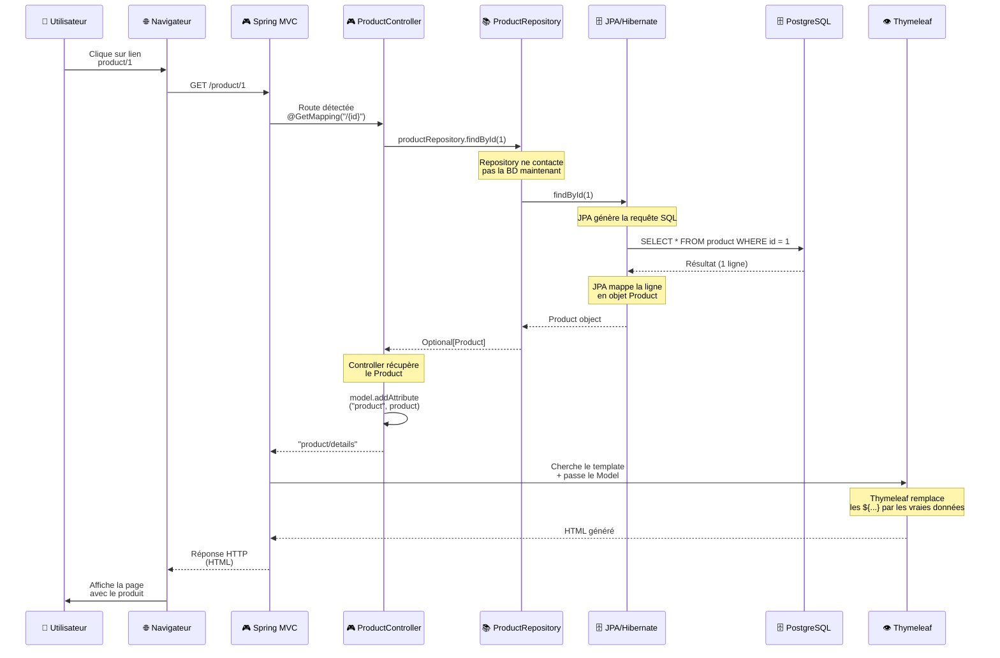

# 🗄️ JPA et Hibernate - De la Base de Données à Java

Un guide complet pour comprendre **comment JPA gère automatiquement votre base de données**.

---

## 📋 Table des matières
1. [Qu'est-ce que JPA ?](#jpa)
2. [Configuration dans application.yaml](#config)
3. [Créer des entités](#entities)
4. [Héritage et MappedSuperclass](#inheritance)
5. [Embeddable : Objets imbriqués](#embeddable)
6. [Relationships et associations](#relationships)
7. [Clés composites](#composite-keys)
8. [Les Repositories](#repositories)
9. [Injection de dépendance](#injection)
10. [Flux complet d'une feature](#flux)
11. [Exercices pratiques](#exercices)

---

## 🤔 Qu'est-ce que JPA ? {#jpa}

### Le problème sans JPA
Avant JPA, il fallait écrire du SQL à la main :

```java
// ❌ SANS JPA - Code verbeux et répétitif
String sql = "SELECT * FROM product WHERE id = ?";
PreparedStatement stmt = connection.prepareStatement(sql);
stmt.setLong(1, id);
ResultSet rs = stmt.executeQuery();

if (rs.next()) {
    Product product = new Product();
    product.setId(rs.getLong("id"));
    product.setName(rs.getString("name"));
    product.setPrice(rs.getDouble("price"));
    // ... pour CHAQUE champ
    return product;
}
```

### La solution : JPA (Java Persistence API)

JPA est une **abstraction** qui :
- ✅ Vous épargne d'écrire du SQL brut
- ✅ Mappe automatiquement les objets Java ↔ Lignes BD
- ✅ Gère les relations entre tables
- ✅ Génère les tables automatiquement
- ✅ Crée des requêtes SQL optimisées

```java
// ✅ AVEC JPA - Simple et élégant
Product product = productRepository.findById(id).orElseThrow();
```

**C'est magique ?** Non, c'est Hibernate ! Hibernate est l'implémentation de JPA que Spring utilise.

### Le flux JPA

```
Objet Java (Product)
    ↓
Hibernate génère le SQL automatiquement
    ↓
Envoie à PostgreSQL
    ↓
PostgreSQL exécute le SQL
    ↓
Retourne les données
    ↓
Hibernate mappe dans un objet Java
    ↓
Vous avez votre Product
```

---

## 🔧 Configuration dans application.yaml {#config}

### Où configurer ?
Créez le fichier : `src/main/resources/application.yaml`

### Configuration complète

```yaml
spring:
  application:
    name: TfJava2026IntroSpringMvc

  # Configuration datasource (connexion BD)
  datasource:
    url: jdbc:postgresql://localhost:5432/tf_mvc_db
    username: postgres
    password: your_password
    driver-class-name: org.postgresql.Driver

  # Configuration JPA/Hibernate
  jpa:
    database-platform: org.hibernate.dialect.PostgreSQLDialect
    hibernate:
      # ⭐ LE PARAMÈTRE LE PLUS IMPORTANT
      ddl-auto: update
    properties:
      hibernate:
        dialect: org.hibernate.dialect.PostgreSQLDialect
        format_sql: true
    show-sql: true  # Affiche le SQL généré (à désactiver en prod)

server:
  port: 8080
```

### Le paramètre magique : `ddl-auto`

`ddl-auto` (Data Definition Language) contrôle **comment Hibernate gère les tables**.

| Valeur | Comportement | Quand utiliser |
|--------|-------------|----------------|
| **create** | ⚠️ Supprime tout, recrée les tables | JAMAIS en production |
| **create-drop** | ⚠️ Crée au démarrage, supprime à l'arrêt | Tests unitaires |
| **update** | ✅ Ajoute les colonnes manquantes, crée les tables | Développement |
| **validate** | ✅ Vérifie que les entités correspondent à la BD | Production |
| **none** | ❌ Ne rien faire | Gestion manuelle du SQL |

**Recommandation** :
```yaml
# Développement
ddl-auto: update

# Production (vous gérez les migrations)
ddl-auto: validate
```

### Qu'est-ce que Hibernate fait avec `ddl-auto: update` ?



---

## 🏛️ Créer des entités {#entities}

### Structure d'une entité

```java
package be.bstorm.tf_java_2026_introspringmvc.entities;

import jakarta.persistence.*;
import lombok.*;

@Entity                    // ← Dit à Hibernate : "Cette classe est une table BD"
@NoArgsConstructor        // ← Lombok : constructeur vide (obligatoire pour JPA)
@AllArgsConstructor       // ← Lombok : constructeur avec tous les champs
@Getter @Setter           // ← Lombok : génère getters/setters
@ToString @EqualsAndHashCode  // ← Lombok : génère toString, equals, hashCode
public class Product {

    @Id                                    // ← Clé primaire
    @GeneratedValue(strategy = GenerationType.IDENTITY)  // ← Auto-incrémentée
    private Long id;

    @Column(
        nullable = false,          // NOT NULL en BD
        unique = true,             // UNIQUE en BD
        length = 100,              // VARCHAR(100) en BD
        columnDefinition = "..."   // SQL personnalisé (rare)
    )
    private String name;

    @Column(nullable = false)
    private Double price;

    @Column(length = 500)
    private String imageUrl;

    @Column()
    private String description;    // Colonne optionnelle
}
```

### Ce que Hibernate génère en SQL

```sql
CREATE TABLE product (
    id BIGSERIAL PRIMARY KEY,
    name VARCHAR(100) NOT NULL UNIQUE,
    price DOUBLE PRECISION NOT NULL,
    image_url VARCHAR(500),
    description TEXT
);
```

### Annotations essentielles

| Annotation | Rôle | Exemple |
|-----------|------|---------|
| `@Entity` | Classe = Table | `@Entity public class Product` |
| `@Id` | Champ = Clé primaire | `@Id private Long id;` |
| `@GeneratedValue` | Auto-incrémente | `@GeneratedValue(strategy = GenerationType.IDENTITY)` |
| `@Column` | Configuration de colonne | `@Column(unique = true, length = 100)` |
| `@ManyToOne` | Relation N→1 | `@ManyToOne private Category category;` |
| `@OneToMany` | Relation 1→N | `@OneToMany(mappedBy = "category")` |
| `@JoinColumn` | Clé étrangère | `@JoinColumn(name = "category_id")` |
| `@Transient` | Champ ignoré par JPA | `@Transient private String temp;` |

---

## 🧬 Héritage et MappedSuperclass {#inheritance}

### Problème : Du code répété dans toutes les entités

Imaginez, chaque entité doit avoir des champs de métadonnées :
- `createdAt` : Quand l'objet a été créé
- `updatedAt` : Quand l'objet a été modifié

```java
// ❌ SANS héritage - Code dupliqué partout
@Entity
public class Product {
    @Id @GeneratedValue(strategy = GenerationType.IDENTITY)
    private Long id;
    private String name;
    @CreationTimestamp private LocalDateTime createdAt;
    @UpdateTimestamp private LocalDateTime updatedAt;
}

@Entity
public class Category {
    @Id @GeneratedValue(strategy = GenerationType.IDENTITY)
    private Long id;
    private String name;
    @CreationTimestamp private LocalDateTime createdAt;
    @UpdateTimestamp private LocalDateTime updatedAt;
}

@Entity
public class User {
    @Id @GeneratedValue(strategy = GenerationType.IDENTITY)
    private Long id;
    private String username;
    @CreationTimestamp private LocalDateTime createdAt;
    @UpdateTimestamp private LocalDateTime updatedAt;
}
```

**C'est ennuyeux et pas maintenable !**

### La solution : MappedSuperclass

**MappedSuperclass** est une classe de base qui **n'est pas une table**, mais dont les champs sont hérités par toutes les entités.

```java
// ✅ Classe de base (pas @Entity, mais @MappedSuperclass)
@MappedSuperclass
@NoArgsConstructor @AllArgsConstructor
@Getter @Setter
public abstract class BaseEntity {
    
    @CreationTimestamp
    private LocalDateTime createdAt;
    
    @UpdateTimestamp
    private LocalDateTime updatedAt;
}

// ✅ Les entités héritent les champs
@Entity
public class Product extends BaseEntity {
    @Id @GeneratedValue(strategy = GenerationType.IDENTITY)
    private Long id;
    private String name;
    private Double price;
}

@Entity
public class Category extends BaseEntity {
    @Id @GeneratedValue(strategy = GenerationType.IDENTITY)
    private Long id;
    private String name;
}
```

**SQL généré** :
```sql
CREATE TABLE product (
    id BIGSERIAL PRIMARY KEY,
    name VARCHAR(100),
    price DOUBLE PRECISION,
    created_at TIMESTAMP,
    updated_at TIMESTAMP
);

CREATE TABLE category (
    id BIGSERIAL PRIMARY KEY,
    name VARCHAR(50),
    created_at TIMESTAMP,
    updated_at TIMESTAMP
);
```

### Différence : @MappedSuperclass vs @Entity

| Aspect | @MappedSuperclass | @Entity (hérité) |
|--------|---|---|
| **Table en BD** | ❌ Non | ✅ Oui |
| **Instance** | ❌ Impossible | ✅ Possible |
| **Champs hérités** | ✅ Oui | ✅ Oui |
| **Utilité** | Partager du code | Polymorphisme |

### Dans notre projet

```java
// BaseEntity.java
@MappedSuperclass
@NoArgsConstructor @AllArgsConstructor
public abstract class BaseEntity {
    
    @Getter @Setter
    @CreationTimestamp
    private LocalDateTime createdAt;
    
    @Getter @Setter
    @UpdateTimestamp
    private LocalDateTime updatedAt;
}

// Product.java
@Entity
public class Product extends BaseEntity {
    @Id @GeneratedValue(strategy = GenerationType.IDENTITY)
    private Long id;
    private String name;
}

// Category.java
@Entity
public class Category extends BaseEntity {
    @Id @GeneratedValue(strategy = GenerationType.IDENTITY)
    private Long id;
    private String name;
}
```

**Avantages** :
- ✅ Pas de duplication
- ✅ Métadonnées automatiques
- ✅ Audit trail (qui a créé, quand)

---

## 📦 Embeddable : Objets imbriqués {#embeddable}

### Problème : Plusieurs colonnes d'adresse

Quand on commande un produit, il faut une adresse de livraison. On pourrait faire :

```java
// ❌ SANS Embeddable - Trop de colonnes
@Entity
public class Order {
    @Id @GeneratedValue(strategy = GenerationType.IDENTITY)
    private Long id;
    
    private String street;
    private String number;
    private String postalCode;
    private String city;
}
```

**Problèmes** :
- ❌ Mélange les concepts (commande + adresse)
- ❌ Pas réutilisable (User peut aussi avoir une adresse)
- ❌ Peu orienté objet

### La solution : @Embeddable

**@Embeddable** crée une classe qui s'**imbrique** dans une entité **sans créer de table supplémentaire**.

```java
// ✅ Classe Embeddable (pas @Entity)
@Embeddable
@NoArgsConstructor @AllArgsConstructor
@Getter @Setter
public class Address {
    
    @Column(length = 100, nullable = false)
    private String street;
    
    @Column(length = 10, nullable = false)
    private String number;
    
    @Column(length = 4, nullable = false)
    private String postalCode;
    
    @Column(length = 100, nullable = false)
    private String city;
}

// ✅ Utiliser @Embedded pour intégrer l'adresse
@Entity
public class Order extends BaseEntity {
    @Id @GeneratedValue(strategy = GenerationType.IDENTITY)
    private Long id;
    
    @Embedded  // ← L'adresse est imbriquée DANS cette table
    private Address address;
}
```

**SQL généré** (une seule table) :
```sql
CREATE TABLE order (
    id BIGSERIAL PRIMARY KEY,
    street VARCHAR(100) NOT NULL,
    number VARCHAR(10) NOT NULL,
    postal_code VARCHAR(4) NOT NULL,
    city VARCHAR(100) NOT NULL,
    created_at TIMESTAMP,
    updated_at TIMESTAMP
);
```

### Utilisation en Java

```java
// Créer une adresse
Address address = new Address("Rue de la Paix", "42", "1000", "Bruxelles");

// L'intégrer dans une commande
Order order = new Order();
order.setAddress(address);

// Accéder à l'adresse
String city = order.getAddress().getCity();  // "Bruxelles"
```

### Avantages de @Embeddable

- ✅ Pas de table supplémentaire
- ✅ Code réutilisable (Address dans Order, User, etc.)
- ✅ Orienté objet
- ✅ Pas de clé étrangère compliquée

### Embeddable avec ID composite

Pour les tables de liaison (many-to-many), on peut utiliser un **ID composite** :

```java
@Entity
public class CartLine extends BaseEntity {
    
    // ✅ Clé composite (2 colonnes)
    @EmbeddedId
    private CartLineId id;
    
    @Getter @Setter
    @Column(nullable = false)
    private int quantity;
    
    @ManyToOne
    @JoinColumn(name = "cart_id", nullable = false)
    @MapsId("cartId")  // ← Lie le champ cartId du CartLineId
    private Cart cart;
    
    @ManyToOne
    @JoinColumn(name = "product_id", nullable = false)
    @MapsId("productId")  // ← Lie le champ productId du CartLineId
    private Product product;
}

// ✅ La clé composite
@Embeddable
@NoArgsConstructor @AllArgsConstructor
public static class CartLineId {
    @Getter @Setter private Long cartId;
    @Getter @Setter private Long productId;
}
```

**SQL généré** :
```sql
CREATE TABLE cart_line (
    cart_id BIGINT NOT NULL,
    product_id BIGINT NOT NULL,
    quantity INT NOT NULL,
    PRIMARY KEY (cart_id, product_id),
    FOREIGN KEY (cart_id) REFERENCES cart(id),
    FOREIGN KEY (product_id) REFERENCES product(id)
);
```

---

## 🏛️ Héritage d'entités : Polymorphisme {#entity-inheritance}

### Scénario : Des types de commandes différentes

Une commande peut être :
- Une `Order` (commande payée et livrée)
- Un `Cart` (panier en cours)

Les deux partagent des champs communs mais ont aussi des champs spécifiques.

### Stratégies d'héritage en JPA

#### 1️⃣ **TABLE_PER_CLASS** (Chaque classe = sa table)

```java
@Entity
@Inheritance(strategy = InheritanceType.TABLE_PER_CLASS)
@NoArgsConstructor @AllArgsConstructor
public abstract class BaseOrder extends BaseEntity {
    
    @Id @GeneratedValue
    private Long id;
    
    // Champs communs à Order et Cart
}

@Entity
public class Order extends BaseOrder {
    
    @ManyToOne(fetch = FetchType.LAZY)
    @JoinColumn(name = "user_id", nullable = false)
    private User user;
    
    @Embedded
    private Address address;
}

@Entity
public class Cart extends BaseOrder {
    
    @OneToOne(fetch = FetchType.LAZY)
    @JoinColumn(name = "user_id", nullable = false)
    private User user;
}
```

**SQL généré** :
```sql
-- Pas de table base_order !
CREATE TABLE order (
    id BIGSERIAL PRIMARY KEY,
    user_id BIGINT NOT NULL,
    street VARCHAR(100),
    created_at TIMESTAMP
);

CREATE TABLE cart (
    id BIGSERIAL PRIMARY KEY,
    user_id BIGINT NOT NULL,
    created_at TIMESTAMP
);
```

**Avantages** : ✅ Simple, ✅ Chaque table a exactement ses colonnes
**Inconvénients** : ❌ Requête complexe pour récupérer tous les BaseOrder

#### 2️⃣ **SINGLE_TABLE** (Une table pour tous)

```java
@Entity
@Inheritance(strategy = InheritanceType.SINGLE_TABLE)
@DiscriminatorColumn(name = "type")  // ← Colonne qui indique le type
public abstract class BaseOrder extends BaseEntity {
    @Id @GeneratedValue
    private Long id;
}

@Entity
@DiscriminatorValue("ORDER")  // ← Valeur pour Order
public class Order extends BaseOrder {
    private User user;
    private Address address;
}

@Entity
@DiscriminatorValue("CART")  // ← Valeur pour Cart
public class Cart extends BaseOrder {
    private User user;
}
```

**SQL généré** :
```sql
CREATE TABLE base_order (
    id BIGSERIAL PRIMARY KEY,
    type VARCHAR(50) NOT NULL,  -- 'ORDER' ou 'CART'
    user_id BIGINT,
    street VARCHAR(100),
    number VARCHAR(10),
    postal_code VARCHAR(4),
    city VARCHAR(100),
    created_at TIMESTAMP
);
```

**Avantages** : ✅ Requête rapide, ✅ Une seule table
**Inconvénients** : ❌ Beaucoup de NULL, ❌ Colonnes mélangées

#### 3️⃣ **JOINED** (Clés étrangères)

```java
@Entity
@Inheritance(strategy = InheritanceType.JOINED)
public abstract class BaseOrder extends BaseEntity {
    @Id @GeneratedValue
    private Long id;
}

@Entity
public class Order extends BaseOrder {
    private User user;
    private Address address;
}

@Entity
public class Cart extends BaseOrder {
    private User user;
}
```

**SQL généré** :
```sql
CREATE TABLE base_order (
    id BIGSERIAL PRIMARY KEY,
    created_at TIMESTAMP
);

CREATE TABLE order (
    id BIGSERIAL PRIMARY KEY,
    user_id BIGINT NOT NULL,
    street VARCHAR(100),
    FOREIGN KEY (id) REFERENCES base_order(id)
);

CREATE TABLE cart (
    id BIGSERIAL PRIMARY KEY,
    user_id BIGINT NOT NULL,
    FOREIGN KEY (id) REFERENCES base_order(id)
);
```

**Avantages** : ✅ Propre, ✅ Pas de NULL
**Inconvénients** : ❌ Requêtes avec JOIN (plus lentes)

### Résumé des stratégies

| Stratégie | Tables | Requête | Espace |
|-----------|--------|---------|--------|
| **TABLE_PER_CLASS** | 2 tables | ⚠️ Complexe (UNION) | ✅ Optimal |
| **SINGLE_TABLE** | 1 table | ✅ Rapide | ❌ Gaspillée (NULL) |
| **JOINED** | 3 tables | ⚠️ JOIN | ✅ Propre |

### Dans notre projet

```java
@Entity
@Inheritance(strategy = InheritanceType.TABLE_PER_CLASS)
public abstract class BaseOrder extends BaseEntity {
    @Id @GeneratedValue
    private Long id;
}

@Entity
public class Order extends BaseOrder {
    @ManyToOne(fetch = FetchType.LAZY)
    private User user;
    
    @Embedded
    private Address address;
}

@Entity
public class Cart extends BaseOrder {
    @OneToOne(fetch = FetchType.LAZY)
    private User user;
}
```

---

## 🔗 Relationships et associations {#relationships}

### Relation ManyToOne (N→1)

**Scénario** : Plusieurs produits → Une seule catégorie

```java
// ENTITY CÔTÉ "N" (Many)
@Entity
public class Product {
    @Id @GeneratedValue(strategy = GenerationType.IDENTITY)
    private Long id;
    
    private String name;
    
    @ManyToOne(
        fetch = FetchType.EAGER,      // Charge la catégorie immédiatement
        cascade = { CascadeType.MERGE } // Si catégorie est mise à jour, produit aussi
    )
    @JoinColumn(
        name = "category_id",         // Nom de la clé étrangère en BD
        nullable = false              // NOT NULL
    )
    private Category category;        // L'objet Java
}

// ENTITY CÔTÉ "1" (One)
@Entity
public class Category {
    @Id @GeneratedValue(strategy = GenerationType.IDENTITY)
    private Long id;
    
    private String name;
    
    // ✅ Côté One, c'est optionnel de déclarer la relation inverse et ça peut être problématique
    @OneToMany(mappedBy = "category")
    private List<Product> products;
}
```

**SQL généré** :
```sql
CREATE TABLE category (
    id BIGSERIAL PRIMARY KEY,
    name VARCHAR(50) NOT NULL UNIQUE
);

CREATE TABLE product (
    id BIGSERIAL PRIMARY KEY,
    name VARCHAR(100) NOT NULL UNIQUE,
    price DOUBLE PRECISION NOT NULL,
    category_id BIGINT NOT NULL,
    FOREIGN KEY (category_id) REFERENCES category(id)
);
```

### Comment utiliser la relation en Java

```java
// ✅ Créer un produit avec une catégorie
Product laptop = new Product();
laptop.setName("Laptop");
laptop.setPrice(999.0);

Category electronics = categoryRepository.findById(1L).orElseThrow();
laptop.setCategory(electronics);

productRepository.save(laptop);
// Hibernate génère : INSERT INTO product ... WHERE category_id = 1

// ✅ Récupérer un produit avec sa catégorie
Product product = productRepository.findById(1L).orElseThrow();
String categoryName = product.getCategory().getName();  // Accès direct !

// ✅ Récupérer tous les produits d'une catégorie
Category electronics = categoryRepository.findById(1L).orElseThrow();
List<Product> products = electronics.getProducts();  // Si @OneToMany est déclaré
```

### FetchType : EAGER vs LAZY

```java
// ❌ LAZY (par défaut en ManyToOne)
@ManyToOne(fetch = FetchType.LAZY)
private Category category;
// → Hibernate ne charge PAS la catégorie avec le produit
// → Accès à product.getCategory() génère UNE AUTRE requête (N+1 problem)

// ✅ EAGER
@ManyToOne(fetch = FetchType.EAGER)
private Category category;
// → Hibernate charge la catégorie AVEC le produit (1 seule requête)
// → Plus rapide pour les relations essentielles
```

### Relation OneToMany (1→N)

**Scénario** : Une catégorie → Plusieurs produits (inverse de ManyToOne)

La relation OneToMany est généralement déclarée du côté "1", mais l'annotation @JoinColumn est du côté N (ManyToOne) :

```java
@Entity
public class Category {
    @Id @GeneratedValue(strategy = GenerationType.IDENTITY)
    private Long id;
    
    private String name;
    
    @OneToMany(mappedBy = "category", fetch = FetchType.LAZY)
    private List<Product> products = new ArrayList<>();
}
```

**Note** : Le `mappedBy = "category"` signifie "l'attribut category dans Product gère cette relation".

### Relation OneToOne (1↔1)

**Scénario** : Un panier (Cart) appartient à UN utilisateur, et un utilisateur a UN panier

```java
@Entity
public class Cart extends BaseOrder {
    
    @OneToOne(
        fetch = FetchType.LAZY,
        cascade = { CascadeType.MERGE }
    )
    @JoinColumn(
        name = "user_id",
        nullable = false
    )
    private User user;  // Un cart = un user
}

@Entity
public class User {
    @Id @GeneratedValue(strategy = GenerationType.IDENTITY)
    private Long id;
    
    private String username;
    
    // ✅ Optionnel : la relation inverse
    @OneToOne(mappedBy = "user")
    private Cart cart;
}
```

**SQL généré** :
```sql
CREATE TABLE cart (
    id BIGSERIAL PRIMARY KEY,
    user_id BIGINT NOT NULL UNIQUE,  -- ← UNIQUE (une seule fois)
    FOREIGN KEY (user_id) REFERENCES user_(id)
);
```

**Utilisation** :
```java
User user = userRepository.findById(1L).orElseThrow();
Cart cart = user.getCart();  // Récupérer son panier
```

### Relation ManyToMany (N↔N)

**Scénario** : Les utilisateurs ont une liste de souhaits (wishlist) de produits. Plusieurs utilisateurs peuvent aimer le même produit.

```java
@Entity
public class User extends BaseEntity {
    @Id @GeneratedValue(strategy = GenerationType.IDENTITY)
    private Long id;
    
    private String username;
    
    // ✅ ManyToMany avec table de liaison
    @ManyToMany(
        fetch = FetchType.LAZY,
        cascade = { CascadeType.MERGE }
    )
    @JoinTable(
        name = "wishlist",  // ← Table de liaison
        joinColumns = @JoinColumn(name = "user_id"),
        inverseJoinColumns = @JoinColumn(name = "product_id")
    )
    private Set<Product> wishlist = new HashSet<>();
    
    public void addToWishlist(Product product) {
        wishlist.add(product);
    }
    
    public void removeFromWishlist(Product product) {
        wishlist.remove(product);
    }
}

@Entity
public class Product extends BaseEntity {
    // ...
    // ✅ Optionnel : relation inverse
    @ManyToMany(mappedBy = "wishlist")
    private Set<User> usersWishlisting = new HashSet<>();
}
```

**SQL généré** :
```sql
-- Table de liaison automatique
CREATE TABLE wishlist (
    user_id BIGINT NOT NULL,
    product_id BIGINT NOT NULL,
    PRIMARY KEY (user_id, product_id),
    FOREIGN KEY (user_id) REFERENCES user_(id),
    FOREIGN KEY (product_id) REFERENCES product(id)
);
```

**Utilisation** :
```java
User user = userRepository.findById(1L).orElseThrow();
Product laptop = productRepository.findById(10L).orElseThrow();

// Ajouter à la wishlist
user.addToWishlist(laptop);
userRepository.save(user);

// Récupérer la wishlist
Set<Product> wishlist = user.getWishlist();

// Supprimer de la wishlist
user.removeFromWishlist(laptop);
userRepository.save(user);
```

### Résumé des relations

| Relation | Côté | Annotation | Utilité |
|----------|------|-----------|---------|
| **ManyToOne** | N | `@ManyToOne` | Plusieurs produits → Une catégorie |
| **OneToMany** | 1 | `@OneToMany` | Une catégorie → Plusieurs produits (inverse) |
| **OneToOne** | 1 | `@OneToOne` | Un panier → Un utilisateur |
| **ManyToMany** | N | `@ManyToMany` + `@JoinTable` | Plusieurs users → Plusieurs products |

### Cascade : Qu'est-ce que ça fait ?

Le paramètre `cascade` dit à Hibernate comment réagir quand l'objet parent change :

```java
@ManyToOne(cascade = { CascadeType.MERGE, CascadeType.PERSIST })
private Category category;

// Avec CascadeType.PERSIST :
// categoryRepository.save(category)  → Hibernate sauvegarde aussi les produits liés
//
// Avec CascadeType.MERGE :
// categoryRepository.save(existingCategory)  → Hibernate met à jour aussi les produits liés
//
// Avec CascadeType.REMOVE :
// categoryRepository.delete(category)  → Hibernate supprime aussi les produits ! ⚠️
```

**Attention** : `CascadeType.REMOVE` peut être dangereux ! Pensez bien avant de l'utiliser.

---

## 🗝️ Clés composites {#composite-keys}

### Problème : Une table avec clé composée

Dans la relation many-to-many entre Cart et Product, on besoin d'une clé unique qui combine :
- L'ID du panier
- L'ID du produit

### Solution : @EmbeddedId avec CartLineId

```java
@Entity
public class CartLine extends BaseEntity {
    
    // ✅ Clé composite (combinaison de cartId + productId)
    @EmbeddedId
    private CartLineId id;
    
    @Getter @Setter
    @Column(nullable = false)
    private int quantity;
    
    // Les relations vers Cart et Product
    @ManyToOne(fetch = FetchType.LAZY)
    @JoinColumn(name = "cart_id", nullable = false)
    @MapsId("cartId")  // ← Lie ce champ au cartId de la clé
    private Cart cart;
    
    @ManyToOne(fetch = FetchType.LAZY)
    @JoinColumn(name = "product_id", nullable = false)
    @MapsId("productId")  // ← Lie ce champ au productId de la clé
    private Product product;
}

// La clé composite
@Embeddable
@NoArgsConstructor @AllArgsConstructor
public static class CartLineId {
    @Getter @Setter private Long cartId;
    @Getter @Setter private Long productId;
}
```

**Utilisation** :
```java
// Créer une ligne de panier
Cart cart = cartRepository.findById(1L).orElseThrow();
Product laptop = productRepository.findById(10L).orElseThrow();

CartLine line = new CartLine(5, cart, laptop);  // 5 quantités
cartLineRepository.save(line);

// Récupérer une ligne
CartLineId id = new CartLineId(1L, 10L);
CartLine line = cartLineRepository.findById(id).orElseThrow();
```

---

## 📚 Les Repositories {#repositories}

### Qu'est-ce qu'un Repository ?

Un **Repository** est l'intermédiaire entre votre code et la BD. C'est l'endroit où vous demandez les données **sans écrire du SQL**.

### JpaRepository - La magie Spring

```java
import org.springframework.data.jpa.repository.JpaRepository;
import org.springframework.stereotype.Repository;

@Repository  // ← Dit à Spring "Je suis un repository"
public interface ProductRepository extends JpaRepository<Product, Long> {
    // <Product> = La classe d'entité
    // <Long>    = Le type de la clé primaire
    
    // ✅ Méthodes fournies GRATUITEMENT par JpaRepository :
    // findAll()                          // SELECT * FROM product
    // findById(id)                       // SELECT * FROM product WHERE id = ?
    // save(product)                      // INSERT ou UPDATE
    // delete(product)                    // DELETE
    // deleteById(id)                     // DELETE WHERE id = ?
    // count()                            // SELECT COUNT(*) FROM product
    // exists(id)                         // EXISTS
    
    // 🎨 Vous pouvez aussi ajouter des méthodes custom
}
```

### Méthodes courantes avec exemples

```java
@Repository
public interface ProductRepository extends JpaRepository<Product, Long> {

    // Spring comprend les méthodes par convention de nommage !
    
    // Chercher par un champ spécifique
    Optional<Product> findByName(String name);
    
    // Chercher par plage de prix
    List<Product> findByPriceBetween(Double min, Double max);
    
    // Chercher avec deux conditions (AND)
    List<Product> findByNameAndPrice(String name, Double price);
    
    // Chercher avec OR
    List<Product> findByNameOrDescription(String name, String desc);
    
    // Chercher avec Like (contient)
    List<Product> findByNameContaining(String name);
    
    // Chercher avec comparaison
    List<Product> findByPriceGreaterThan(Double price);
    List<Product> findByPriceLessThanEqual(Double price);
    
    // Trier les résultats
    List<Product> findAll(Sort.by("price").descending());
    
    // Paginer les résultats
    Page<Product> findAll(Pageable pageable);
}
```

### Méthodes avec @Query (requêtes custom)

```java
@Repository
public interface ProductRepository extends JpaRepository<Product, Long> {

    // Requête JPQL (Query Language spécifique à JPA, pas du SQL brut)
    @Query("select p from Product p where p.price > :minPrice")
    List<Product> findExpensiveProducts(@Param("minPrice") Double minPrice);
    
    // Requête SQL natif PostgreSQL
    @Query(value = "SELECT * FROM product WHERE price > :minPrice", nativeQuery = true)
    List<Product> findExpensiveProductsSQL(@Param("minPrice") Double minPrice);
    
    // Requête complexe avec plusieurs conditions
    @Query("select p from Product p " +
           "where (:name is null or p.name ilike ('%' || :name || '%')) " +
           "and (:minPrice is null or p.price >= :minPrice) " +
           "and (:maxPrice is null or p.price <= :maxPrice) " +
           "and (:categoryId is null or p.category.id = :categoryId)")
    List<Product> findWithFilter(
        @Param("name") String name,
        @Param("minPrice") Double minPrice,
        @Param("maxPrice") Double maxPrice,
        @Param("categoryId") Long categoryId
    );
}
```

### Utilisation en Controller

```java
@Controller
@RequestMapping("/product")
public class ProductController {
    
    private final ProductRepository productRepository;
    
    // Spring injecte automatiquement le repository
    public ProductController(ProductRepository productRepository) {
        this.productRepository = productRepository;
    }
    
    @GetMapping("/{id}")
    public String details(@PathVariable Long id, Model model) {
        // Les méthodes du Repository
        Optional<Product> product = productRepository.findById(id);
        
        // Ou directement avec exception si pas trouvé
        Product p = productRepository.findById(id).orElseThrow();
        
        model.addAttribute("product", p);
        return "product/details";
    }
    
    @GetMapping
    public String index(
        @RequestParam(required = false) Double minPrice,
        Model model
    ) {
        // Utiliser les méthodes custom du repository
        List<Product> products = productRepository.findByPriceGreaterThan(minPrice != null ? minPrice : 0);
        
        model.addAttribute("products", products);
        return "product/index";
    }
}
```

---

## 💉 Injection de dépendance {#injection}

### Qu'est-ce que l'injection de dépendance ?

**Injection de dépendance** = Spring crée les objets pour vous et les passe où on en a besoin.

### Sans injection (❌ Pas bon)

```java
public class ProductController {
    
    private ProductRepository productRepository;
    
    public ProductController() {
        // ❌ Problème : Créer manuellement toutes les dépendances
        this.productRepository = new ProductRepository();  // ❌ ça ne marche pas comme ça
    }
}
```

### Avec injection (✅ Bon)

#### Méthode 1 : Via le constructeur (recommandé)

```java
@Controller
public class ProductController {
    
    private final ProductRepository productRepository;
    
    // Spring voit le constructeur et injecte automatiquement
    public ProductController(ProductRepository productRepository) {
        this.productRepository = productRepository;
    }
}
```

#### Méthode 2 : Via @Autowired

```java
@Controller
public class ProductController {
    
    @Autowired  // ← Spring injecte ici
    private ProductRepository productRepository;
}
```

#### Méthode 3 : Lombok + @RequiredArgsConstructor (le mieux)

```java
@Controller
@RequiredArgsConstructor  // ← Lombok génère le constructeur automatiquement
public class ProductController {
    
    private final ProductRepository productRepository;
    // Spring injecte via le constructeur généré par Lombok
}
```

### Pourquoi la dépendance injection ?

```
❌ SANS injection :
- Couplage fort (ProductController dépend directement de ProductRepository)
- Difficile à tester (impossible de mocker le repository)
- Si ProductRepository change, faut tout réécrire

✅ AVEC injection :
- Couplage faible (ProductController ne sait pas comment créer le repository)
- Facile à tester (on peut passer un mock repository)
- Flexible et maintenable
```

### Exemple de test avec injection

```java
@Test
public void testProductDetails() {
    // Créer un mock du repository
    ProductRepository mockRepo = Mockito.mock(ProductRepository.class);
    
    Product testProduct = new Product();
    testProduct.setId(1L);
    testProduct.setName("Test Product");
    
    // Dire au mock quoi retourner
    Mockito.when(mockRepo.findById(1L)).thenReturn(Optional.of(testProduct));
    
    // Injecter le mock dans le controller
    ProductController controller = new ProductController(mockRepo);
    
    // Tester
    String view = controller.details(1L, new Model());
    
    // Vérifier
    assertEquals("product/details", view);
}
```

---

## 🔄 Flux complet d'une feature {#flux}

### Scénario : L'utilisateur clique pour voir un produit



### Ce que JPA fait pour vous (le côté caché)

```java
// Ce que vous écrivez
Product product = productRepository.findById(1L).orElseThrow();

// Ce que JPA fait secrètement
/*
1. Détecte l'appel à findById
2. Génère la requête SQL :
   SELECT p1_0.id, p1_0.category_id, p1_0.description, p1_0.image_url, p1_0.name, p1_0.price
   FROM product p1_0
   WHERE p1_0.id = 1

3. Se connecte à PostgreSQL
4. Exécute la requête
5. Reçoit le résultat (1 ligne avec 6 colonnes)
6. Crée un nouvel objet Product
7. Mappe chaque colonne au champ correspondant :
   - p1_0.id → product.id = 1
   - p1_0.name → product.name = "Laptop"
   - p1_0.price → product.price = 999.0
   - p1_0.category_id → (charge la Category si EAGER)
   - ... etc
8. Retourne Optional.of(product)
*/
```

### Étapes clés du flux

| Étape | Qui intervient | Quoi |
|-------|----------------|------|
| 1 | Navigateur | Requête HTTP GET /product/1 |
| 2 | Spring | Reçoit et route vers Controller |
| 3 | Controller | Appelle repository.findById(1) |
| 4 | JPA/Hibernate | Génère le SQL SELECT |
| 5 | PostgreSQL | Exécute et retourne une ligne |
| 6 | JPA/Hibernate | Mappe la ligne → objet Product |
| 7 | Controller | Ajoute Product au Model |
| 8 | Thymeleaf | Remplace les ${product.name} |
| 9 | Spring | Retourne le HTML généré |
| 10 | Navigateur | Affiche la page |

---

## ✨ À retenir

### Configuration JPA
1. `application.yaml` configure la connexion BD et JPA
2. `ddl-auto: update` crée/modifie les tables automatiquement
3. `ddl-auto: validate` en production (vous gérez les migrations)

### Entités et héritage
1. `@Entity` = Classe = Table
2. `@MappedSuperclass` = Classe de base (pas de table), champs hérités
3. `@Inheritance` = Polymorphisme (TABLE_PER_CLASS, SINGLE_TABLE, JOINED)
4. `@Id @GeneratedValue` = Clé primaire auto-incrémentée
5. `@Column` = Configuration de colonne

### Objets imbriqués
1. `@Embeddable` = Classe non-persistée, imbriquée dans une entité
2. `@Embedded` = Intégrer un Embeddable dans une entité
3. `@EmbeddedId` = Clé primaire composite avec Embeddable
4. `@MapsId` = Lier une relation à une partie d'une clé composite

### Relationships (Associations)
| Relation | Annotations | Table de liaison |
|----------|-------------|------------------|
| **ManyToOne** | `@ManyToOne` sur la classe "N" | Non (clé étrangère) |
| **OneToMany** | `@OneToMany(mappedBy=...)` sur la classe "1" | Non (inverse) |
| **OneToOne** | `@OneToOne` + `@JoinColumn` | Non (clé étrangère UNIQUE) |
| **ManyToMany** | `@ManyToMany` + `@JoinTable` | OUI (table de liaison) |

### Repositories
1. `JpaRepository<Entity, ID>` = CRUD automatique
2. Méthodes par convention : `findBy...`
3. `@Query` pour requêtes complexes
4. Spring génère l'implémentation automatiquement

### Injection de dépendance
1. Évite le couplage fort
2. Facilite les tests
3. Spring crée et injecte automatiquement
4. Utiliser `@RequiredArgsConstructor` (Lombok)

### Flux d'une feature
```
Navigateur → Spring → Controller → Repository → JPA → PostgreSQL
                                                    ↓
                    Thymeleaf ← Model ← Controller ← JPA
         ↓
      Navigateur (HTML affiché)
```