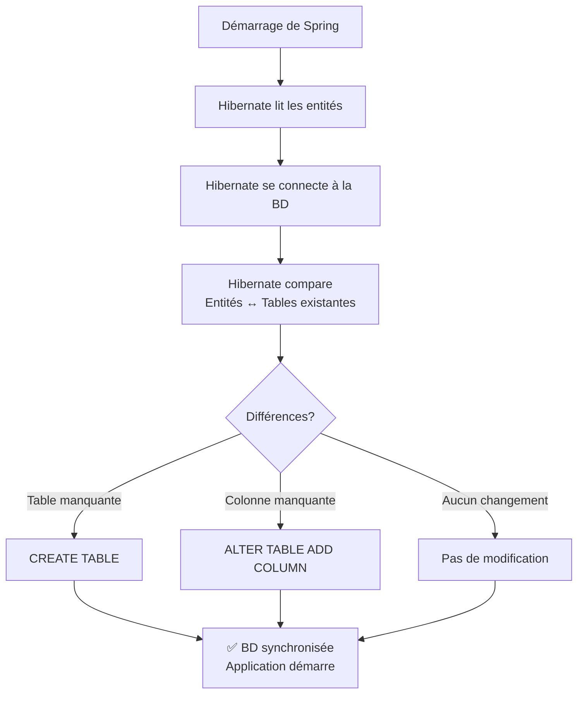
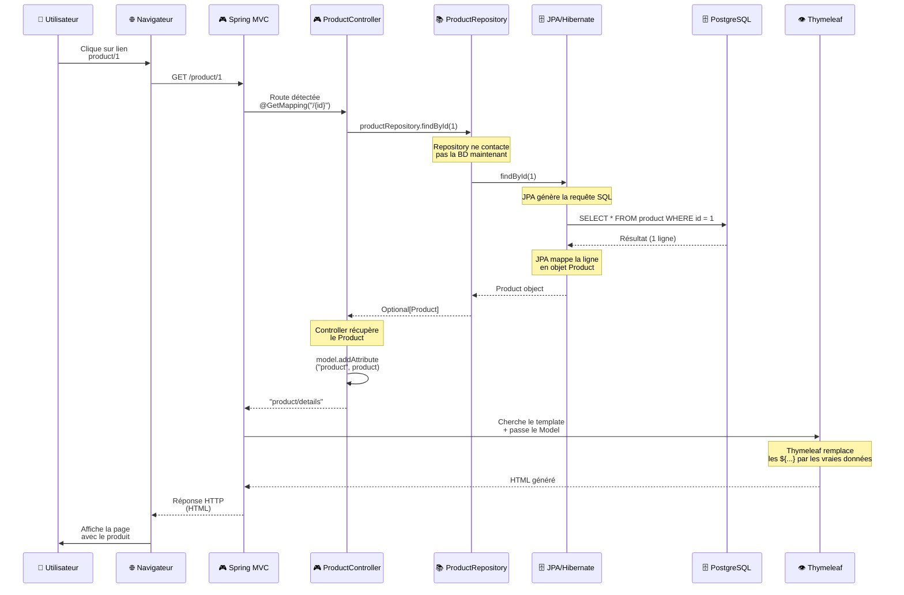

# 🗄️ JPA et Hibernate - De la Base de Données à Java

Un guide complet pour comprendre **comment JPA gère automatiquement votre base de données**.

---

## 📋 Table des matières
1. [Qu'est-ce que JPA ?](#jpa)
2. [Configuration dans application.yaml](#config)
3. [Créer des entités](#entities)
4. [Relationships et associations](#relationships)
5. [Les Repositories](#repositories)
6. [Injection de dépendance](#injection)
7. [Flux complet d'une feature](#flux)
8. [Exercices pratiques](#exercices)

---

## 🤔 Qu'est-ce que JPA ? {#jpa}

### Le problème sans JPA
Avant JPA, il fallait écrire du SQL à la main :

```java
// ❌ SANS JPA - Code verbeux et répétitif
String sql = "SELECT * FROM product WHERE id = ?";
PreparedStatement stmt = connection.prepareStatement(sql);
stmt.setLong(1, id);
ResultSet rs = stmt.executeQuery();

if (rs.next()) {
    Product product = new Product();
    product.setId(rs.getLong("id"));
    product.setName(rs.getString("name"));
    product.setPrice(rs.getDouble("price"));
    // ... pour CHAQUE champ
    return product;
}
```

### La solution : JPA (Java Persistence API)

JPA est une **abstraction** qui :
- ✅ Vous épargne d'écrire du SQL brut
- ✅ Mappe automatiquement les objets Java ↔ Lignes BD
- ✅ Gère les relations entre tables
- ✅ Génère les tables automatiquement
- ✅ Crée des requêtes SQL optimisées

```java
// ✅ AVEC JPA - Simple et élégant
Product product = productRepository.findById(id).orElseThrow();
```

**C'est magique ?** Non, c'est Hibernate ! Hibernate est l'implémentation de JPA que Spring utilise.

### Le flux JPA

```
Objet Java (Product)
    ↓
Hibernate génère le SQL automatiquement
    ↓
Envoie à PostgreSQL
    ↓
PostgreSQL exécute le SQL
    ↓
Retourne les données
    ↓
Hibernate mappe dans un objet Java
    ↓
Vous avez votre Product
```

---

## 🔧 Configuration dans application.yaml {#config}

### Où configurer ?
Créez le fichier : `src/main/resources/application.yaml`

### Configuration complète

```yaml
spring:
  application:
    name: TfJava2026IntroSpringMvc

  # Configuration datasource (connexion BD)
  datasource:
    url: jdbc:postgresql://localhost:5432/tf_mvc_db
    username: postgres
    password: your_password
    driver-class-name: org.postgresql.Driver

  # Configuration JPA/Hibernate
  jpa:
    database-platform: org.hibernate.dialect.PostgreSQLDialect
    hibernate:
      # ⭐ LE PARAMÈTRE LE PLUS IMPORTANT
      ddl-auto: update
    properties:
      hibernate:
        dialect: org.hibernate.dialect.PostgreSQLDialect
        format_sql: true
    show-sql: true  # Affiche le SQL généré (à désactiver en prod)

server:
  port: 8080
```

### Le paramètre magique : `ddl-auto`

`ddl-auto` (Data Definition Language) contrôle **comment Hibernate gère les tables**.

| Valeur | Comportement | Quand utiliser |
|--------|-------------|----------------|
| **create** | ⚠️ Supprime tout, recrée les tables | JAMAIS en production |
| **create-drop** | ⚠️ Crée au démarrage, supprime à l'arrêt | Tests unitaires |
| **update** | ✅ Ajoute les colonnes manquantes, crée les tables | Développement |
| **validate** | ✅ Vérifie que les entités correspondent à la BD | Production |
| **none** | ❌ Ne rien faire | Gestion manuelle du SQL |

**Recommandation** :
```yaml
# Développement
ddl-auto: update

# Production (vous gérez les migrations)
ddl-auto: validate
```

### Qu'est-ce que Hibernate fait avec `ddl-auto: update` ?



---

## 🏛️ Créer des entités {#entities}

### Structure d'une entité

```java
package be.bstorm.tf_java_2026_introspringmvc.entities;

import jakarta.persistence.*;
import lombok.*;

@Entity                    // ← Dit à Hibernate : "Cette classe est une table BD"
@NoArgsConstructor        // ← Lombok : constructeur vide (obligatoire pour JPA)
@AllArgsConstructor       // ← Lombok : constructeur avec tous les champs
@Getter @Setter           // ← Lombok : génère getters/setters
@ToString @EqualsAndHashCode  // ← Lombok : génère toString, equals, hashCode
public class Product {

    @Id                                    // ← Clé primaire
    @GeneratedValue(strategy = GenerationType.IDENTITY)  // ← Auto-incrémentée
    private Long id;

    @Column(
        nullable = false,          // NOT NULL en BD
        unique = true,             // UNIQUE en BD
        length = 100,              // VARCHAR(100) en BD
        columnDefinition = "..."   // SQL personnalisé (rare)
    )
    private String name;

    @Column(nullable = false)
    private Double price;

    @Column(length = 500)
    private String imageUrl;

    @Column()
    private String description;    // Colonne optionnelle
}
```

### Ce que Hibernate génère en SQL

```sql
CREATE TABLE product (
    id BIGSERIAL PRIMARY KEY,
    name VARCHAR(100) NOT NULL UNIQUE,
    price DOUBLE PRECISION NOT NULL,
    image_url VARCHAR(500),
    description TEXT
);
```

### Annotations essentielles

| Annotation | Rôle | Exemple |
|-----------|------|---------|
| `@Entity` | Classe = Table | `@Entity public class Product` |
| `@Id` | Champ = Clé primaire | `@Id private Long id;` |
| `@GeneratedValue` | Auto-incrémente | `@GeneratedValue(strategy = GenerationType.IDENTITY)` |
| `@Column` | Configuration de colonne | `@Column(unique = true, length = 100)` |
| `@ManyToOne` | Relation N→1 | `@ManyToOne private Category category;` |
| `@OneToMany` | Relation 1→N | `@OneToMany(mappedBy = "category")` |
| `@JoinColumn` | Clé étrangère | `@JoinColumn(name = "category_id")` |
| `@Transient` | Champ ignoré par JPA | `@Transient private String temp;` |

---

## 🔗 Relationships et associations {#relationships}

### Relation ManyToOne (N→1)

**Scénario** : Plusieurs produits → Une seule catégorie

```java
// ENTITY CÔTÉ "N" (Many)
@Entity
public class Product {
    @Id @GeneratedValue(strategy = GenerationType.IDENTITY)
    private Long id;
    
    private String name;
    
    @ManyToOne(
        fetch = FetchType.EAGER,      // Charge la catégorie immédiatement
        cascade = { CascadeType.MERGE } // Si catégorie est mise à jour, produit aussi
    )
    @JoinColumn(
        name = "category_id",         // Nom de la clé étrangère en BD
        nullable = false              // NOT NULL
    )
    private Category category;        // L'objet Java
}

// ENTITY CÔTÉ "1" (One)
@Entity
public class Category {
    @Id @GeneratedValue(strategy = GenerationType.IDENTITY)
    private Long id;
    
    private String name;
    
    // ✅ Côté One, c'est optionnel de déclarer la relation inverse et ça peut être problématique
    @OneToMany(mappedBy = "category")
    private List<Product> products;
}
```

**SQL généré** :
```sql
CREATE TABLE category (
    id BIGSERIAL PRIMARY KEY,
    name VARCHAR(50) NOT NULL UNIQUE
);

CREATE TABLE product (
    id BIGSERIAL PRIMARY KEY,
    name VARCHAR(100) NOT NULL UNIQUE,
    price DOUBLE PRECISION NOT NULL,
    category_id BIGINT NOT NULL,
    FOREIGN KEY (category_id) REFERENCES category(id)
);
```

### Comment utiliser la relation en Java

```java
// ✅ Créer un produit avec une catégorie
Product laptop = new Product();
laptop.setName("Laptop");
laptop.setPrice(999.0);

Category electronics = categoryRepository.findById(1L).orElseThrow();
laptop.setCategory(electronics);

productRepository.save(laptop);
// Hibernate génère : INSERT INTO product ... WHERE category_id = 1

// ✅ Récupérer un produit avec sa catégorie
Product product = productRepository.findById(1L).orElseThrow();
String categoryName = product.getCategory().getName();  // Accès direct !

// ✅ Récupérer tous les produits d'une catégorie
Category electronics = categoryRepository.findById(1L).orElseThrow();
List<Product> products = electronics.getProducts();  // Si @OneToMany est déclaré
```

### FetchType : EAGER vs LAZY

```java
// ❌ LAZY (par défaut en ManyToOne)
@ManyToOne(fetch = FetchType.LAZY)
private Category category;
// → Hibernate ne charge PAS la catégorie avec le produit
// → Accès à product.getCategory() génère UNE AUTRE requête (N+1 problem)

// ✅ EAGER
@ManyToOne(fetch = FetchType.EAGER)
private Category category;
// → Hibernate charge la catégorie AVEC le produit (1 seule requête)
// → Plus rapide pour les relations essentielles
```

---

## 📚 Les Repositories {#repositories}

### Qu'est-ce qu'un Repository ?

Un **Repository** est l'intermédiaire entre votre code et la BD. C'est l'endroit où vous demandez les données **sans écrire du SQL**.

### JpaRepository - La magie Spring

```java
import org.springframework.data.jpa.repository.JpaRepository;
import org.springframework.stereotype.Repository;

@Repository  // ← Dit à Spring "Je suis un repository"
public interface ProductRepository extends JpaRepository<Product, Long> {
    // <Product> = La classe d'entité
    // <Long>    = Le type de la clé primaire
    
    // ✅ Méthodes fournies GRATUITEMENT par JpaRepository :
    // findAll()                          // SELECT * FROM product
    // findById(id)                       // SELECT * FROM product WHERE id = ?
    // save(product)                      // INSERT ou UPDATE
    // delete(product)                    // DELETE
    // deleteById(id)                     // DELETE WHERE id = ?
    // count()                            // SELECT COUNT(*) FROM product
    // exists(id)                         // EXISTS
    
    // 🎨 Vous pouvez aussi ajouter des méthodes custom
}
```

### Méthodes courantes avec exemples

```java
@Repository
public interface ProductRepository extends JpaRepository<Product, Long> {

    // Spring comprend les méthodes par convention de nommage !
    
    // Chercher par un champ spécifique
    Optional<Product> findByName(String name);
    
    // Chercher par plage de prix
    List<Product> findByPriceBetween(Double min, Double max);
    
    // Chercher avec deux conditions (AND)
    List<Product> findByNameAndPrice(String name, Double price);
    
    // Chercher avec OR
    List<Product> findByNameOrDescription(String name, String desc);
    
    // Chercher avec Like (contient)
    List<Product> findByNameContaining(String name);
    
    // Chercher avec comparaison
    List<Product> findByPriceGreaterThan(Double price);
    List<Product> findByPriceLessThanEqual(Double price);
    
    // Trier les résultats
    List<Product> findAll(Sort.by("price").descending());
    
    // Paginer les résultats
    Page<Product> findAll(Pageable pageable);
}
```

### Méthodes avec @Query (requêtes custom)

```java
@Repository
public interface ProductRepository extends JpaRepository<Product, Long> {

    // Requête JPQL (Query Language spécifique à JPA, pas du SQL brut)
    @Query("select p from Product p where p.price > :minPrice")
    List<Product> findExpensiveProducts(@Param("minPrice") Double minPrice);
    
    // Requête SQL natif PostgreSQL
    @Query(value = "SELECT * FROM product WHERE price > :minPrice", nativeQuery = true)
    List<Product> findExpensiveProductsSQL(@Param("minPrice") Double minPrice);
    
    // Requête complexe avec plusieurs conditions
    @Query("select p from Product p " +
           "where (:name is null or p.name ilike ('%' || :name || '%')) " +
           "and (:minPrice is null or p.price >= :minPrice) " +
           "and (:maxPrice is null or p.price <= :maxPrice) " +
           "and (:categoryId is null or p.category.id = :categoryId)")
    List<Product> findWithFilter(
        @Param("name") String name,
        @Param("minPrice") Double minPrice,
        @Param("maxPrice") Double maxPrice,
        @Param("categoryId") Long categoryId
    );
}
```

### Utilisation en Controller

```java
@Controller
@RequestMapping("/product")
public class ProductController {
    
    private final ProductRepository productRepository;
    
    // Spring injecte automatiquement le repository
    public ProductController(ProductRepository productRepository) {
        this.productRepository = productRepository;
    }
    
    @GetMapping("/{id}")
    public String details(@PathVariable Long id, Model model) {
        // Les méthodes du Repository
        Optional<Product> product = productRepository.findById(id);
        
        // Ou directement avec exception si pas trouvé
        Product p = productRepository.findById(id).orElseThrow();
        
        model.addAttribute("product", p);
        return "product/details";
    }
    
    @GetMapping
    public String index(
        @RequestParam(required = false) Double minPrice,
        Model model
    ) {
        // Utiliser les méthodes custom du repository
        List<Product> products = productRepository.findByPriceGreaterThan(minPrice != null ? minPrice : 0);
        
        model.addAttribute("products", products);
        return "product/index";
    }
}
```

---

## 💉 Injection de dépendance {#injection}

### Qu'est-ce que l'injection de dépendance ?

**Injection de dépendance** = Spring crée les objets pour vous et les passe où on en a besoin.

### Sans injection (❌ Pas bon)

```java
public class ProductController {
    
    private ProductRepository productRepository;
    
    public ProductController() {
        // ❌ Problème : Créer manuellement toutes les dépendances
        this.productRepository = new ProductRepository();  // ❌ ça ne marche pas comme ça
    }
}
```

### Avec injection (✅ Bon)

#### Méthode 1 : Via le constructeur (recommandé)

```java
@Controller
public class ProductController {
    
    private final ProductRepository productRepository;
    
    // Spring voit le constructeur et injecte automatiquement
    public ProductController(ProductRepository productRepository) {
        this.productRepository = productRepository;
    }
}
```

#### Méthode 2 : Via @Autowired

```java
@Controller
public class ProductController {
    
    @Autowired  // ← Spring injecte ici
    private ProductRepository productRepository;
}
```

#### Méthode 3 : Lombok + @RequiredArgsConstructor (le mieux)

```java
@Controller
@RequiredArgsConstructor  // ← Lombok génère le constructeur automatiquement
public class ProductController {
    
    private final ProductRepository productRepository;
    // Spring injecte via le constructeur généré par Lombok
}
```

### Pourquoi la dépendance injection ?

```
❌ SANS injection :
- Couplage fort (ProductController dépend directement de ProductRepository)
- Difficile à tester (impossible de mocker le repository)
- Si ProductRepository change, faut tout réécrire

✅ AVEC injection :
- Couplage faible (ProductController ne sait pas comment créer le repository)
- Facile à tester (on peut passer un mock repository)
- Flexible et maintenable
```

### Exemple de test avec injection

```java
@Test
public void testProductDetails() {
    // Créer un mock du repository
    ProductRepository mockRepo = Mockito.mock(ProductRepository.class);
    
    Product testProduct = new Product();
    testProduct.setId(1L);
    testProduct.setName("Test Product");
    
    // Dire au mock quoi retourner
    Mockito.when(mockRepo.findById(1L)).thenReturn(Optional.of(testProduct));
    
    // Injecter le mock dans le controller
    ProductController controller = new ProductController(mockRepo);
    
    // Tester
    String view = controller.details(1L, new Model());
    
    // Vérifier
    assertEquals("product/details", view);
}
```

---

## 🔄 Flux complet d'une feature {#flux}

### Scénario : L'utilisateur clique pour voir un produit



### Ce que JPA fait pour vous (le côté caché)

```java
// Ce que vous écrivez
Product product = productRepository.findById(1L).orElseThrow();

// Ce que JPA fait secrètement
/*
1. Détecte l'appel à findById
2. Génère la requête SQL :
   SELECT p1_0.id, p1_0.category_id, p1_0.description, p1_0.image_url, p1_0.name, p1_0.price
   FROM product p1_0
   WHERE p1_0.id = 1

3. Se connecte à PostgreSQL
4. Exécute la requête
5. Reçoit le résultat (1 ligne avec 6 colonnes)
6. Crée un nouvel objet Product
7. Mappe chaque colonne au champ correspondant :
   - p1_0.id → product.id = 1
   - p1_0.name → product.name = "Laptop"
   - p1_0.price → product.price = 999.0
   - p1_0.category_id → (charge la Category si EAGER)
   - ... etc
8. Retourne Optional.of(product)
*/
```

### Étapes clés du flux

| Étape | Qui intervient | Quoi |
|-------|----------------|------|
| 1 | Navigateur | Requête HTTP GET /product/1 |
| 2 | Spring | Reçoit et route vers Controller |
| 3 | Controller | Appelle repository.findById(1) |
| 4 | JPA/Hibernate | Génère le SQL SELECT |
| 5 | PostgreSQL | Exécute et retourne une ligne |
| 6 | JPA/Hibernate | Mappe la ligne → objet Product |
| 7 | Controller | Ajoute Product au Model |
| 8 | Thymeleaf | Remplace les ${product.name} |
| 9 | Spring | Retourne le HTML généré |
| 10 | Navigateur | Affiche la page |

---

## ✨ À retenir

### Configuration JPA
1. `application.yaml` configure la connexion BD et JPA
2. `ddl-auto: update` crée/modifie les tables automatiquement
3. `ddl-auto: validate` en production (vous gérez les migrations)

### Entités
1. `@Entity` = Classe = Table
2. `@Id @GeneratedValue` = Clé primaire auto-incrémentée
3. `@Column` = Configuration de colonne
4. `@ManyToOne` = Relation N→1

### Repositories
1. `JpaRepository<Entity, ID>` = CRUD automatique
2. Méthodes par convention : `findBy...`
3. `@Query` pour requêtes complexes
4. Spring génère l'implémentation automatiquement

### Injection de dépendance
1. Évite le couplage fort
2. Facilite les tests
3. Spring crée et injecte automatiquement
4. Utiliser `@RequiredArgsConstructor` (Lombok)

### Flux d'une feature
```
Navigateur → Spring → Controller → Repository → JPA → PostgreSQL
                                                    ↓
                    Thymeleaf ← Model ← Controller ← JPA
         ↓
      Navigateur (HTML affiché)
```

---

**Vous maîtrisez maintenant JPA et pouvez accéder à vos données ! 🚀**
