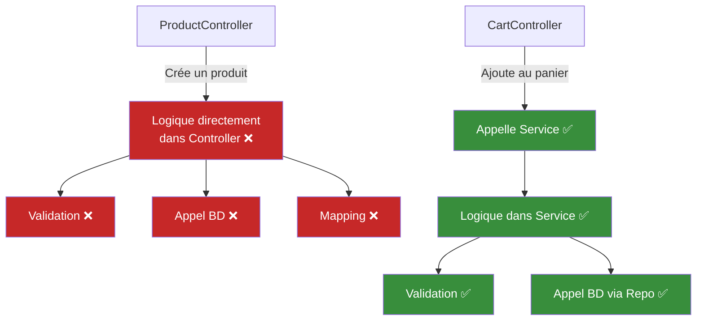
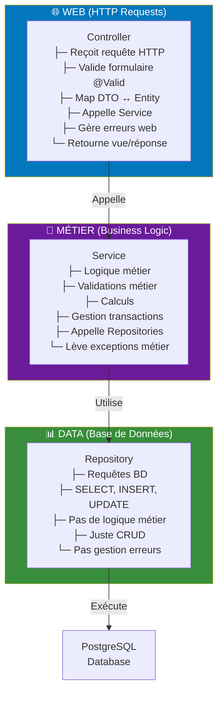
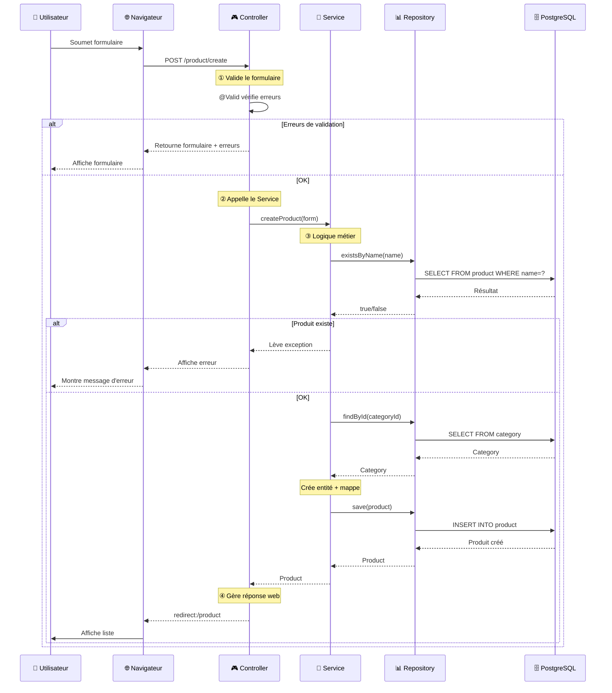
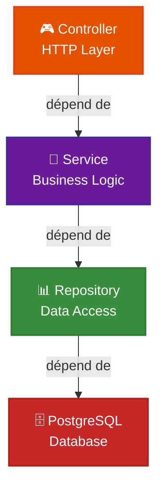
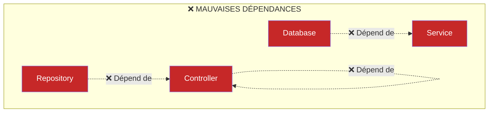
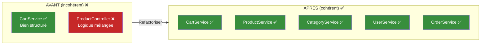

# 🎯 Les Services - La Logique de votre Appli

Un guide pour comprendre **pourquoi il faut séparer la logique métier du web**.

---

## 📋 Table des matières
1. [Le problème : Tout dans le Controller](#probleme)
2. [La solution : Les Services](#solution)
3. [Responsabilité de chacun](#responsabilites)
4. [Architecture en couches](#architecture)
5. [Cas d'usage pratiques](#casusage)
6. [L'importance de la cohérence](#coherence)

---

## 😱 Le problème : Tout dans le Controller {#probleme}

### Scénario 1 : Créer un produit

Regardez le `ProductController.java` actuel :

```java
@PostMapping("/create")
public String create(
        @ModelAttribute(name = "product") ProductForm product,
        BindingResult bindingResult,
        Model model
) {
    // ❌ Validation du formulaire
    if (bindingResult.hasErrors()) {
        model.addAttribute("product", product);
        List<CategoryDto> categories = categoryRepository.findAll().stream()
                        .map(c -> CategoryDto.fromEntity(c))
                        .toList();
        model.addAttribute("categories", categories);
        return "product/create";
    }

    // ❌ Conversion DTO → Entity
    Product newProduct = product.toEntity();

    // ❌ Récupérer la catégorie
    Category category = categoryRepository.findById(newProduct.getCategoryId())
            .orElseThrow();

    // ❌ Mapping
    newProduct.setCategory(category);

    // ❌ Sauvegarde
    productRepository.save(newProduct);

    return "redirect:/product";
}
```

### Scénario 2 : Ajouter un produit au panier

Regardez le `CartService.java` (on l'a fait bien !) :

```java
@Service
@RequiredArgsConstructor
public class CartService {
    
    private final CartRepository cartRepository;
    private final ProductRepository productRepository;
    private final CartLineRepository cartLineRepository;

    public void addToCart(User user, Long productId) {
        // ✅ Logique métier complexe ici
        Product product = productRepository.findById(productId).orElseThrow();
        Cart cart = computeIfAbsent(user);
        List<CartLine> cartLines = cartLineRepository.findByCartId(cart.getId());
        
        Optional<CartLine> existingLine = cartLines.stream()
                .filter(cl -> cl.getProduct().getId().equals(productId))
                .findFirst();

        if(existingLine.isPresent()) {
            CartLine line = existingLine.get();
            line.setQuantity(line.getQuantity() + 1);
            cartLineRepository.save(line);
        } else {
            CartLine line = new CartLine(1, cart, product);
            cartLineRepository.save(line);
        }
    }
}
```

### Le problème principal : INCOHÉRENCE 🚨



**C'est un CAUCHEMAR pour la maintenabilité !**

### Autres problèmes

#### 1️⃣ **Code dupliqué**
Si vous voulez créer un produit depuis l'API REST, il faudra dupliquer tout ce code :

```java
@RestController
@PostMapping("/api/products")
public ResponseEntity<Product> createProductAPI(@RequestBody ProductForm form) {
    // ❌ Copier-coller la même logique du web
    if (bindingResult.hasErrors()) { ... }
    Product newProduct = form.toEntity();
    Category category = categoryRepository.findById(...).orElseThrow();
    newProduct.setCategory(category);
    productRepository.save(newProduct);
    return ResponseEntity.ok(newProduct);
}
```

#### 2️⃣ **Difficile à tester**
Tester un controller, c'est tester le web + la logique métier en même temps :

```java
@Test
public void testCreateProduct() {
    // ❌ On doit mocker le Controller, le formulaire, la BD...
    // ❌ C'est complexe et lent
    // ❌ On teste le web ET la logique métier (trop)
}
```

#### 3️⃣ **Logique métier éparpillée**
Si on veut changer "comment on crée un produit", où va-t-on le faire ?
- Dans le controller ?
- Dans le repository ?
- Dans le formulaire ?

**Personne ne sait !** 😵

#### 4️⃣ **Pas de réutilisation**
La logique "créer un produit" est utile pour :
- Web form ✅
- API REST ✅
- Import CSV ✅
- Batch night ✅

Si c'est dans le controller, c'est perdu !

---

## ✅ La solution : Les Services {#solution}

### Idée simple

Créer une **couche métier** (Service) qui :
1. Contient la logique complexe
2. Est réutilisable partout
3. Est facile à tester
4. Est indépendante du web

### Un vrai Service : ProductService

```java
@Service
@RequiredArgsConstructor
public class ProductService {
    
    private final ProductRepository productRepository;
    private final CategoryRepository categoryRepository;
    
    /**
     * Créer un produit avec validation métier
     */
    public Product createProduct(ProductForm form) {
        // ✅ Validation métier
        if (productRepository.existsByName(form.getName())) {
            throw new IllegalArgumentException("Un produit avec ce nom existe déjà");
        }
        
        // ✅ Récupérer la catégorie
        Category category = categoryRepository.findById(form.getCategoryId())
                .orElseThrow(() -> new IllegalArgumentException("Catégorie non trouvée"));
        
        // ✅ Créer l'entité
        Product product = form.toEntity();
        product.setCategory(category);
        
        // ✅ Sauvegarder
        return productRepository.save(product);
    }
    
    /**
     * Mettre à jour un produit
     */
    public Product updateProduct(Long id, ProductForm form) {
        Product existing = productRepository.findById(id)
                .orElseThrow(() -> new IllegalArgumentException("Produit non trouvé"));
        
        // ✅ Validation métier : le nouveau nom ne doit pas exister
        if (!form.getName().equals(existing.getName()) && 
            productRepository.existsByName(form.getName())) {
            throw new IllegalArgumentException("Ce nom existe déjà");
        }
        
        // ✅ Mettre à jour les champs
        existing.setName(form.getName());
        existing.setDescription(form.getDescription());
        existing.setPrice(form.getPrice());
        existing.setImageUrl(form.getImageUrl());
        
        // ✅ Changer la catégorie si nécessaire
        if (!form.getCategoryId().equals(existing.getCategoryId())) {
            Category category = categoryRepository.findById(form.getCategoryId())
                    .orElseThrow();
            existing.setCategory(category);
        }
        
        return productRepository.save(existing);
    }
    
    /**
     * Supprimer un produit
     */
    public void deleteProduct(Long id) {
        if (!productRepository.existsById(id)) {
            throw new IllegalArgumentException("Produit non trouvé");
        }
        productRepository.deleteById(id);
    }
}
```

### Refactoriser le Controller

Maintenant, le controller devient **très simple** :

```java
@Controller
@RequestMapping("/product")
@RequiredArgsConstructor
public class ProductController {
    
    private final ProductService productService;      // ← Service injecté
    private final ProductRepository productRepository; // ← Pour lire seulement
    private final CategoryRepository categoryRepository;
    
    @GetMapping
    public String index(@ModelAttribute ProductFilter filter, Model model) {
        // ✅ Récupérer et afficher
        List<Product> products = productRepository.findWithFilter(
            filter.name(), filter.minPrice(), filter.maxPrice(), filter.categoryId()
        );
        List<ProductIndexDto> dtos = products.stream()
                .map(ProductIndexDto::fromEntity)
                .toList();
        
        model.addAttribute("products", dtos);
        return "product/index";
    }
    
    @PostMapping("/create")
    public String create(
            @ModelAttribute(name = "product") ProductForm form,
            BindingResult bindingResult,
            Model model
    ) {
        // ✅ Validation du formulaire
        if (bindingResult.hasErrors()) {
            model.addAttribute("product", form);
            model.addAttribute("categories", categoryRepository.findAll());
            return "product/create";
        }
        
        // ✅ Appeler le service (une ligne !)
        try {
            productService.createProduct(form);
        } catch (IllegalArgumentException e) {
            model.addAttribute("error", e.getMessage());
            model.addAttribute("product", form);
            model.addAttribute("categories", categoryRepository.findAll());
            return "product/create";
        }
        
        return "redirect:/product";
    }
    
    @PostMapping("/update/{id}")
    public String update(
            @PathVariable Long id,
            @ModelAttribute(name = "product") ProductForm form,
            BindingResult bindingResult,
            Model model
    ) {
        if (bindingResult.hasErrors()) {
            model.addAttribute("productId", id);
            model.addAttribute("categories", categoryRepository.findAll());
            return "product/update";
        }
        
        // ✅ Appeler le service (une ligne !)
        try {
            productService.updateProduct(id, form);
        } catch (IllegalArgumentException e) {
            model.addAttribute("error", e.getMessage());
            model.addAttribute("productId", id);
            model.addAttribute("categories", categoryRepository.findAll());
            return "product/update";
        }
        
        return "redirect:/product";
    }
    
    @PostMapping("/delete/{id}")
    public String delete(@PathVariable Long id) {
        try {
            productService.deleteProduct(id);
        } catch (IllegalArgumentException e) {
            // Gérer l'erreur
            return "redirect:/product?error=" + e.getMessage();
        }
        return "redirect:/product";
    }
}
```

### Comparer les deux approches

| Aspect | SANS Service | AVEC Service |
|--------|---|---|
| **Lignes de code controller** | 50+ | 10-15 |
| **Où est la logique ?** | Partout 😭 | En un seul endroit ✅ |
| **Réutilisable ?** | Non ❌ | Oui ✅ |
| **Facile à tester ?** | Non ❌ | Oui ✅ |
| **Code dupliqué ?** | Oui ❌ | Non ✅ |

---

## 🏗️ Responsabilité de chacun {#responsabilites}

### Architecture propre



Exemple complet : Flux d'une requête



### Détail de chaque responsabilité

#### 🎮 Controller : Interface Web

**Rôle** : Intermédiaire entre l'utilisateur et la logique métier

```java
@Controller
public class ProductController {
    
    private final ProductService productService;
    
    @PostMapping("/product")
    public String create(
        @ModelAttribute @Valid ProductForm form,  // ← Valider le formulaire
        BindingResult errors,
        Model model
    ) {
        // ✅ Responsabilités du Controller
        
        // 1. Valider le formulaire (syntaxe)
        if (errors.hasErrors()) {
            model.addAttribute("form", form);
            return "product/create";  // ← Retourner la vue
        }
        
        // 2. Appeler le service (ne PAS faire la logique ici)
        try {
            Product product = productService.createProduct(form);  // ← Une ligne !
        } catch (IllegalArgumentException e) {
            // 3. Gérer les erreurs métier pour le web
            model.addAttribute("error", e.getMessage());
            return "product/create";
        }
        
        // 4. Retourner une réponse web
        return "redirect:/product";
    }
    
    // ❌ NE PAS faire ceci dans le Controller:
    // - Requêtes BD directes
    // - Logique métier complexe
    // - Calculs
    // - Validations métier
}
```

#### 🎯 Service : Logique Métier

**Rôle** : Contient TOUTE la logique métier, peut être utilisé partout

```java
@Service
@RequiredArgsConstructor
public class ProductService {
    
    private final ProductRepository productRepository;
    private final CategoryRepository categoryRepository;
    
    public Product createProduct(ProductForm form) {
        // ✅ Responsabilités du Service
        
        // 1. Valider les règles métier
        if (productRepository.existsByName(form.getName())) {
            throw new IllegalArgumentException("Produit existant");
        }
        
        // 2. Récupérer les données nécessaires
        Category category = categoryRepository.findById(form.getCategoryId())
                .orElseThrow();
        
        // 3. Effectuer la logique
        Product product = form.toEntity();
        product.setCategory(category);
        
        // 4. Utiliser les repositories pour persister
        return productRepository.save(product);
    }
    
    // ✅ Le Service PEUT être appelé de partout :
    // - Web Controller
    // - API REST Controller
    // - Batch de nuit
    // - Import CSV
    // - Ligne de commande
}
```

#### 📊 Repository : Accès aux Données

**Rôle** : CRUD simplement, pas de logique

```java
@Repository
public interface ProductRepository extends JpaRepository<Product, Long> {
    
    // ✅ Responsabilités du Repository
    
    // 1. Requêtes CRUD simples
    Optional<Product> findById(Long id);
    List<Product> findAll();
    Product save(Product product);
    void deleteById(Long id);
    
    // 2. Requêtes personnalisées (mais SIMPLES)
    List<Product> findByNameContaining(String name);
    List<Product> findByPriceGreaterThan(Double price);
    
    // 3. Requêtes complexes (mais SANS logique métier)
    @Query("select p from Product p where p.category.id = :categoryId")
    List<Product> findByCategory(@Param("categoryId") Long categoryId);
    
    // ❌ NE PAS faire ceci dans le Repository:
    // - Logique métier
    // - Gestion d'erreurs métier
    // - Calculs
    // - Validations métier
}
```

### Exemple complet : Flux d'une requête

```mermaid
graph LR
    A["Utilisateur<br/>remplit formulaire"] -->B["POST /product/create"]
    B --> C["① Controller<br/>valide @Valid"]
    C -->D{Erreurs?}
    D -->|Oui| E["Retourne formulaire<br/>avec erreurs"]
    D -->|Non| F["② Appelle Service<br/>createProduct"]
    F --> G["③ Service vérifie<br/>logique métier"]
    G --> H["Récupère catégorie<br/>via Repository"]
    H --> I["④ Repository<br/>requête BD"]
    I --> J["⑤ PostgreSQL<br/>INSERT"]
    J --> K["Retourne Product"]
    K --> L["⑥ Controller<br/>redirige"]
    L --> M["Navigateur<br/>affiche liste"]
    E --> N["Navigateur<br/>affiche erreurs"]
    
    style A fill:#0277BD,color:#fff
    style C fill:#E65100,color:#fff
    style F fill:#6A1B9A,color:#fff
    style G fill:#6A1B9A,color:#fff
    style H fill:#388E3C,color:#fff
    style I fill:#388E3C,color:#fff
    style J fill:#C62828,color:#fff
    style L fill:#E65100,color:#fff
    style M fill:#0277BD,color:#fff
```



---

## 🏗️ Architecture en couches {#architecture}

### Dépendances entre couches



**Règle d'or** : Chaque couche dépend de celle EN-DESSOUS, pas du contraire.

### JAMAIS faire ceci



### Flux de dépendance correct

```java
// ✅ BON
@Controller
public class ProductController {
    private final ProductService productService;  // ✅ Service seulement
}

@Service
public class ProductService {
    private final ProductRepository productRepository;  // ✅ Repository seulement
    private final CategoryRepository categoryRepository;
}

@Repository
public interface ProductRepository extends JpaRepository<Product, Long> {
    // Ne dépend de rien (sauf de JPA/BD)
}
```

---

## 💡 Cas d'usage pratiques {#casusage}

### Cas 1 : Créer un produit

**Sans Service** : Logique dans ProductController seulement
**Avec Service** : Logique réutilisable partout

```java
// Web Controller
@PostMapping("/product")
public String createWeb(@ModelAttribute ProductForm form) {
    productService.createProduct(form);
    return "redirect:/product";
}

// API REST
@PostMapping("/api/products")
public ResponseEntity<Product> createAPI(@RequestBody ProductForm form) {
    Product product = productService.createProduct(form);
    return ResponseEntity.ok(product);
}

// Batch de nuit
@Scheduled(cron = "0 2 * * *")
public void batchCreateProducts() {
    List<ProductForm> forms = readFromCSV("products.csv");
    forms.forEach(productService::createProduct);  // ← Même logique !
}
```

**Sans Service** : Code dupliqué 3 fois 😭
**Avec Service** : Code écrit 1 fois, utilisé 3 fois ✅

### Cas 2 : Ajouter au panier

Regardez le vrai CartService du projet :

```java
@Service
public class CartService {
    
    public void addToCart(User user, Long productId) {
        // ✅ Logique métier :
        // 1. Vérifier que le produit existe
        // 2. Créer le panier s'il n'existe pas
        // 3. Ajouter à une ligne existante OU créer une nouvelle
        
        Product product = productRepository.findById(productId).orElseThrow();
        Cart cart = computeIfAbsent(user);
        
        List<CartLine> cartLines = cartLineRepository.findByCartId(cart.getId());
        Optional<CartLine> existingLine = cartLines.stream()
                .filter(cl -> cl.getProduct().getId().equals(productId))
                .findFirst();

        if(existingLine.isPresent()) {
            existingLine.get().setQuantity(existingLine.get().getQuantity() + 1);
            cartLineRepository.save(existingLine.get());
        } else {
            CartLine line = new CartLine(1, cart, product);
            cartLineRepository.save(line);
        }
    }
}
```

**Utilisation simple** dans le controller :

```java
@PostMapping("/cart/add/{productId}")
public String addToCart(
        @PathVariable Long productId,
        @AuthenticationPrincipal User user
) {
    cartService.addToCart(user, productId);  // ← Une ligne !
    return "redirect:/product";
}
```

### Cas 3 : Valider une règle métier complexe

Imaginez une règle : "Un produit ne peut pas être supprimé s'il y a des commandes en cours"

```java
@Service
public class ProductService {
    
    public void deleteProduct(Long id) {
        // ✅ Validation métier complexe dans le Service
        List<Order> ordersWithProduct = orderRepository.findByProductId(id);
        
        if (!ordersWithProduct.isEmpty()) {
            throw new IllegalStateException(
                "Impossible de supprimer : " + ordersWithProduct.size() + " commandes en attente"
            );
        }
        
        productRepository.deleteById(id);
    }
}
```

**Le Controller n'a pas besoin de connaître cette règle** :

```java
@PostMapping("/product/delete/{id}")
public String delete(@PathVariable Long id) {
    try {
        productService.deleteProduct(id);  // ← Le Service gère tout
    } catch (IllegalStateException e) {
        // Afficher l'erreur à l'utilisateur
        return "redirect:/product?error=" + e.getMessage();
    }
    return "redirect:/product";
}
```

---

## ⚠️ L'importance de la cohérence {#coherence}

### Le vrai problème du code incohérent

Regardez notre projet :

```
✅ CartService + CartController
   - Logique bien séparée
   - Code propre
   - Facile à tester

❌ ProductController
   - Logique directement dans le controller
   - Code mélangé
   - Difficile à tester
```

**C'est un DÉSASTRE pour la maintenabilité !**

### Pourquoi c'est important

#### 1️⃣ **Les autres développeurs sont perdus**

```
Nouveau dev arrive :
"Où je mets la logique de créer un produit ?"

Cas 1 (ProductController) :
- Cherche dans le controller... trouve du code
- Pense que c'est normal de mettre la logique là

Cas 2 (CartService) :
- Cherche dans le service... trouve du code
- Pense que c'est normal de mettre la logique là

CONFUSION ! 😱
```

#### 2️⃣ **Les bugs se propagent**

Si on doit ajouter une validation "le prix doit être positif" :

```
❌ Si la logique est dans ProductController:
   - Modifier ProductController
   - Oublier de modifier l'API REST
   - Bug : l'API accepte les prix négatifs !
   
✅ Si la logique est dans ProductService:
   - Modifier ProductService une fois
   - Utilisée partout (web, API, batch)
   - Pas de bug !
```

#### 3️⃣ **Les tests sont différents partout**

```java
// Test CartService (facile)
@Test
public void testAddToCart() {
    cartService.addToCart(user, productId);
    // ✅ Test simple de la logique
}

// Test ProductController (difficile, sans service)
@Test
public void testCreateProduct() {
    // ❌ Besoin de mocker le Controller, le formulaire, la BD...
    // ❌ C'est horrible et lent
}
```

### La solution : **Uniformité partout**



**Une fois qu'on utilise des Services quelque part, faut le faire PARTOUT !**

### Checklist de cohérence

Avant de laisser du code en production, vérifiez :

- [ ] **Est-ce que TOUTES les créations utilisent un Service ?**
- [ ] **Est-ce que TOUTES les mises à jour utilisent un Service ?**
- [ ] **Est-ce que TOUTES les supprimations utilisent un Service ?**
- [ ] **Est-ce que la logique métier est SEULEMENT dans les Services ?**
- [ ] **Est-ce que les Controllers sont SIMPLES (< 30 lignes par méthode) ?**
- [ ] **Est-ce que les Repositories ne contiennent que du CRUD ?**

Si la réponse est NON quelque part, vous avez une incohérence !

---

## 🎓 Résumé

### Architecture propre

```
       Controller (Web)
            ↓
        Service (Métier)
            ↓
       Repository (BD)
```

### Responsabilités

| Couche | Responsabilité | Exemples |
|--------|---|---|
| **Controller** | Recevoir requête HTTP, valider formulaire, appeler service, retourner vue | Validation @Valid, mapping DTO |
| **Service** | Logique métier, validations, calculs, transactions | Créer produit, vérifier règles métier |
| **Repository** | CRUD simple, requêtes SQL | findById, save, delete |

### Règles d'or

1. **Une logique = un Service** (créer, mettre à jour, supprimer, etc.)
2. **Services réutilisables** (web, API, batch, CLI, etc.)
3. **Services testables** (pas d'HTTP, pas de web)
4. **Uniformité** (si on utilise des services, on les utilise PARTOUT)
5. **Dépendances en cascade** (Controller → Service → Repository)

### Bénéfices

✅ Code réutilisable
✅ Code testable
✅ Code maintenable
✅ Code cohérent
✅ Moins de bugs
✅ Plus facile à comprendre

---

**Utilisez des Services partout ! 🚀**
