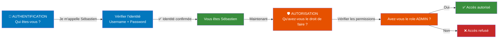
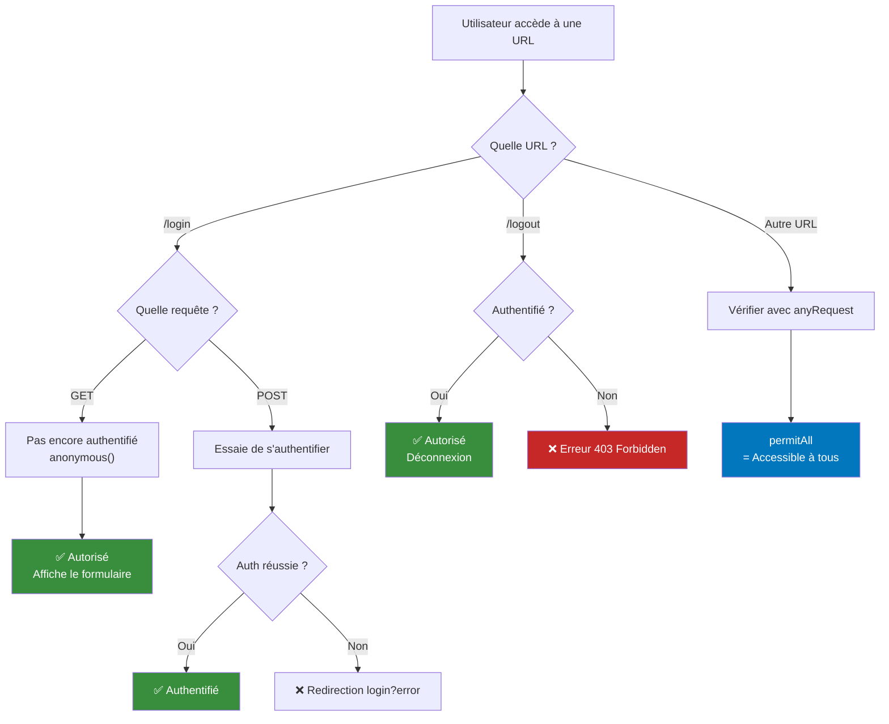
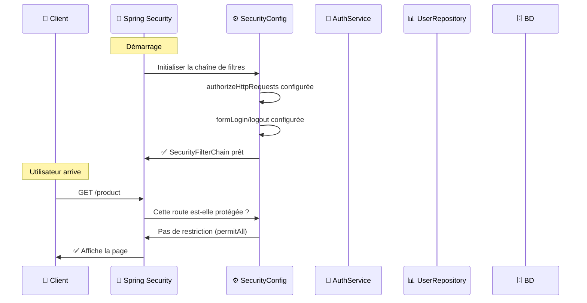
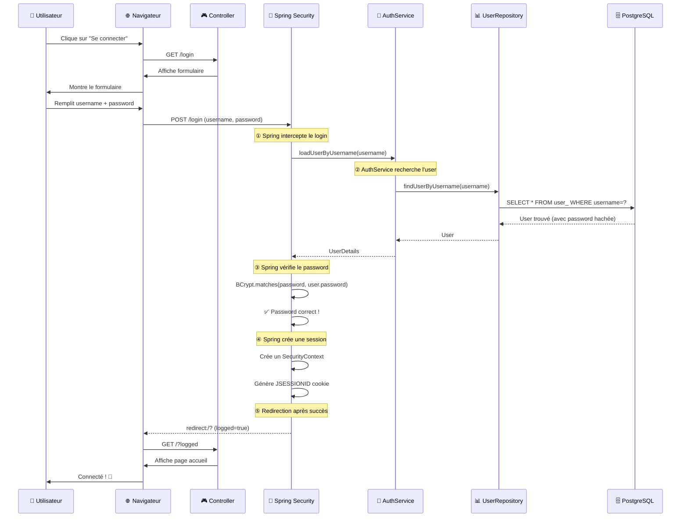
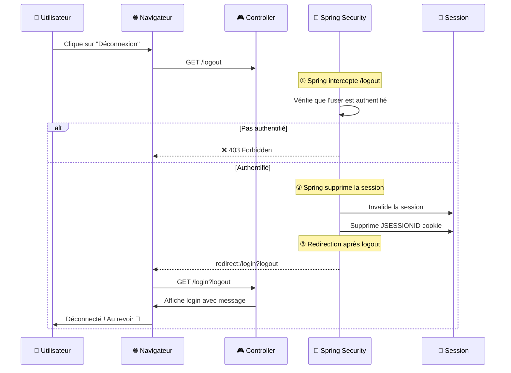
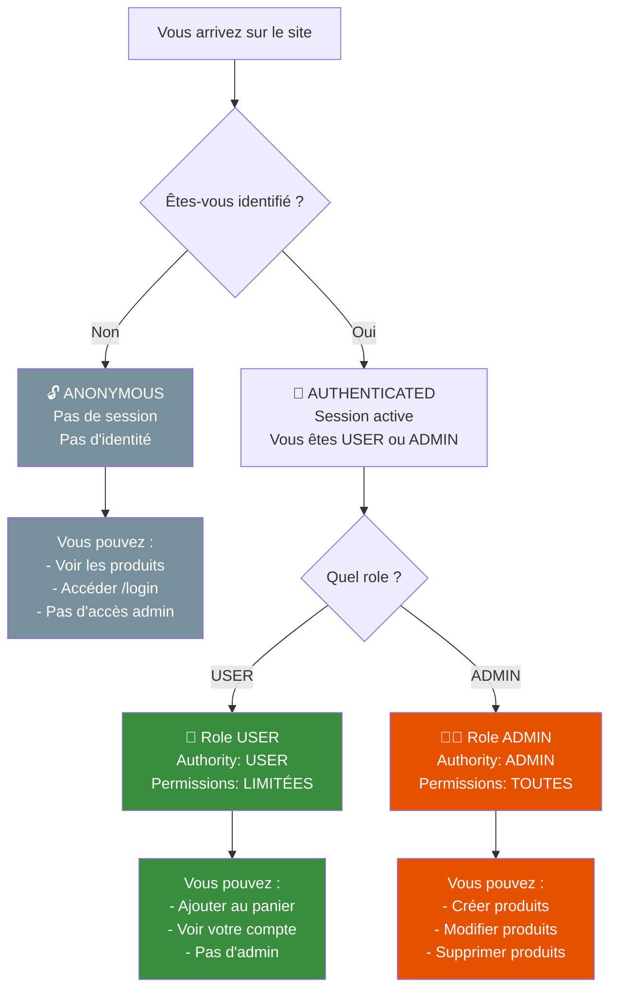
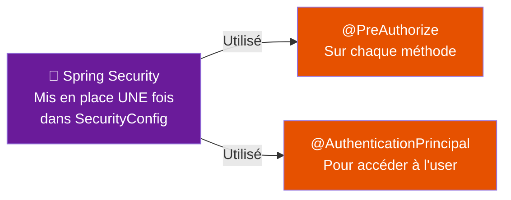
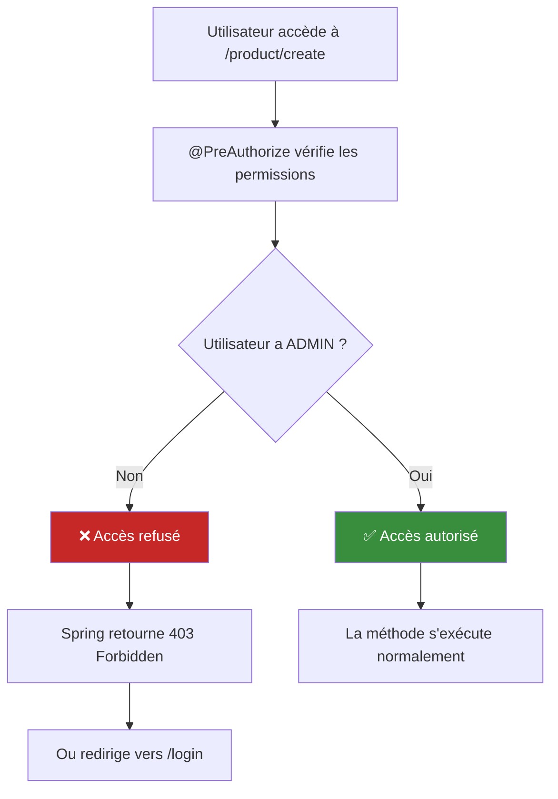
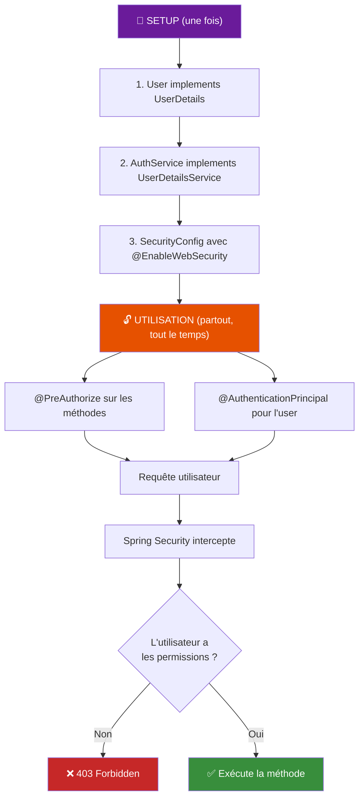
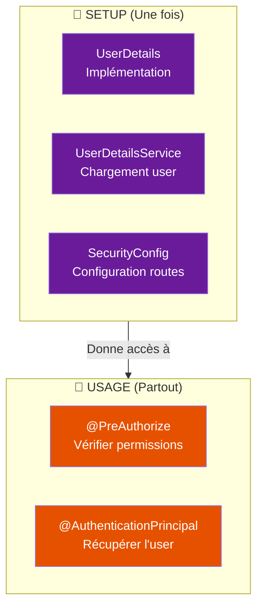

# 🔐 Spring Security - Protéger votre Application

Un guide complet pour comprendre **comment Spring Security gère l'authentification et l'autorisation**.

---

## 📋 Table des matières
1. [Concepts fondamentaux](#concepts)
2. [Les briques de base](#briques)
3. [Configuration avec SecurityConfig](#config)
4. [Flux de login/logout](#flux)
5. [États d'utilisateur et permissions](#etats)
6. [Utilisation avec @PreAuthorize et @AuthenticationPrincipal](#utilisation)

---

## 🤔 Concepts fondamentaux {#concepts}

### Authentification vs Autorisation



**Résumé** :
- **Authentification** = Vérifier que vous êtes bien qui vous prétendez être
- **Autorisation** = Vérifier que vous avez le droit d'accéder à cette ressource

---

## 🏗️ Les briques de base {#briques}

### 1️⃣ **UserDetails** : Qui est l'utilisateur ?

```java
// UserDetails est une interface Spring Security
// Votre entité User DOIT l'implémenter

@Entity
public class User extends BaseEntity implements UserDetails {
    
    @Id @GeneratedValue(strategy = GenerationType.IDENTITY)
    private Long id;
    
    @Column(unique = true, nullable = false)
    private String username;
    
    @Column(nullable = false)
    private String password;  // ← Doit être HACHÉE !
    
    @Enumerated(EnumType.STRING)
    private UserRole role;  // ADMIN, USER, etc.
    
    // ✅ Implémentation de UserDetails
    @Override
    public Collection<? extends GrantedAuthority> getAuthorities() {
        // Retourner les permissions (roles)
        return List.of(new SimpleGrantedAuthority(role.name()));
    }
    
    // Les autres méthodes par défaut retournent true
    @Override
    public boolean isAccountNonExpired() { return true; }
    
    @Override
    public boolean isAccountNonLocked() { return true; }
    
    @Override
    public boolean isCredentialsNonExpired() { return true; }
    
    @Override
    public boolean isEnabled() { return true; }
}
```

**UserDetails, c'est le contrat** : "Spring, voici les infos de cet utilisateur"

### 2️⃣ **UserDetailsService** : Comment charger l'utilisateur ?

```java
@Service
@RequiredArgsConstructor
public class AuthService implements UserDetailsService {
    
    private final UserRepository userRepository;
    
    /**
     * Spring appelle cette méthode pour charger un utilisateur par son username
     */
    @Override
    public UserDetails loadUserByUsername(String username) throws UsernameNotFoundException {
        // Chercher l'utilisateur en BD
        return userRepository.findUserByUsername(username)
                .orElseThrow(() -> new UsernameNotFoundException(
                    "User with username " + username + " not found"
                ));
    }
}
```

**UserDetailsService, c'est la logique** : "Spring, pour récupérer un utilisateur, fais ceci"

### 3️⃣ **SecurityConfig** : Comment configurer Spring Security ?

```java
@Configuration
@EnableWebSecurity
@EnableMethodSecurity  // ← Active @PreAuthorize sur les méthodes
public class SecurityConfig {
    
    @Bean
    public PasswordEncoder passwordEncoder() {
        // BCrypt = hachage sécurisé des mots de passe
        return new BCryptPasswordEncoder();
    }
    
    @Bean
    public SecurityFilterChain filterChain(HttpSecurity http) throws Exception {
        http
            // Configuration des routes et permissions
            .authorizeHttpRequests(r -> r
                .requestMatchers("/login").anonymous()  // Seulement anonymes
                .requestMatchers("/logout").authenticated()  // Seulement authentifiés
                .anyRequest().permitAll()  // Le reste = accessible à tous
            )
            // Configuration du login
            .formLogin(c -> c
                .loginPage("/login")  // Page de login personnalisée
                .permitAll()  // La page de login doit être accessible
                .defaultSuccessUrl("/?logged", true)  // Redirection après login
                .failureUrl("/login?error")  // Redirection si erreur
            )
            // Configuration du logout
            .logout(c -> c
                .logoutUrl("/logout")
                .deleteCookies("JSESSIONID")
                .invalidateHttpSession(true)
                .logoutSuccessUrl("/login?logout")
            );
        
        return http.build();
    }
}
```

---

## 🔧 Configuration avec SecurityConfig {#config}

### Comprendre les routes dans authorizeHttpRequests



### Pourquoi `.anonymous()` et `.permitAll()` ?

```
❌ MAUVAIS : /login seulement accessible aux anonymes
────────────────────────────────────────────────────

Utilisateur authentifié tente d'accéder à /login
    ↓
Spring refuse (pas anonymous)
    ↓
L'utilisateur ne peut pas voir le formulaire
    ↓
❌ IMPOSSIBLE de réutiliser le formulaire pour changer de compte
```

```
✅ BON : Utiliser PreAuthorize dans le Controller
────────────────────────────────────────────────────

Route /login : permitAll()
    ↓
Utilisateur authentifié peut y accéder
    ↓
Dans le Controller :
@GetMapping("/login")
@PreAuthorize("isAnonymous() OR hasAuthority('ADMIN')")
public String login() { ... }
    ↓
✅ Plus flexible et cohérent
```

### Le flux de SecurityConfig



---

## 🔐 Flux de login/logout {#flux}

### Flux de LOGIN complet



**Ce que SPRING fait pour vous** ✅ :
- ✅ Crée un formulaire de login
- ✅ Intercepte le POST /login
- ✅ Appelle `AuthService.loadUserByUsername()`
- ✅ Valide le password avec BCrypt
- ✅ Crée la session + cookie
- ✅ Redirige vers defaultSuccessUrl

**Ce que VOUS faites** 🎮 :
- 🎮 Implémenter `UserDetailsService.loadUserByUsername()`
- 🎮 Créer la page /login (formulaire HTML)
- 🎮 Configurer SecurityConfig

### Flux de LOGOUT complet



**Ce que SPRING fait pour vous** ✅ :
- ✅ Intercepte /logout
- ✅ Vérifie que l'utilisateur est authentifié
- ✅ Invalide la session
- ✅ Supprime les cookies
- ✅ Redirige

**Ce que VOUS faites** 🎮 :
- 🎮 Ajouter un bouton "Déconnexion" dans le template
- 🎮 Configurer logoutUrl et logoutSuccessUrl

---

## 👥 États d'utilisateur et permissions {#etats}

### Les 3 états possibles



### Comprendre les autorités (Authorities)

```java
// Dans l'entité User
@Enumerated(EnumType.STRING)
private UserRole role;  // ADMIN ou USER

// Dans User.getAuthorities()
@Override
public Collection<? extends GrantedAuthority> getAuthorities() {
    // L'authority = le nom du rôle
    return List.of(new SimpleGrantedAuthority(role.name()));
    // Retourne : [ADMIN] ou [USER]
}
```

### Les conditions de sécurité

| Condition | Signification | Exemple |
|-----------|---|---|
| `isAnonymous()` | Pas authentifié | Visiteur qui regarde juste |
| `isAuthenticated()` | Authentifié (peu importe le role) | Utilisateur connecté |
| `hasAuthority('ADMIN')` | A le role ADMIN | Administrateur |
| `hasAuthority('USER')` | A le role USER | Utilisateur normal |
| `hasAnyAuthority('ADMIN', 'USER')` | A au moins un des roles | Tous les authentifiés |

---

## 🔑 Utilisation avec @PreAuthorize et @AuthenticationPrincipal {#utilisation}

### C'est LÀ que vous utilisez Security au quotidien !



### 1️⃣ **@PreAuthorize** : Vérifier les permissions

```java
@Controller
public class ProductController {
    
    // ✅ SANS restriction : tout le monde peut voir
    @GetMapping
    public String index(Model model) {
        // Affiche tous les produits
        return "product/index";
    }
    
    // ✅ Réservé aux admins
    @PreAuthorize("hasAuthority('ADMIN')")
    @GetMapping("/create")
    public String create(Model model) {
        // Affiche le formulaire de création
        return "product/create";
    }
    
    // ✅ Seulement les admins peuvent créer
    @PreAuthorize("hasAuthority('ADMIN')")
    @PostMapping("/create")
    public String createProduct(@ModelAttribute ProductForm form) {
        // Crée un produit
        return "redirect:/product";
    }
    
    // ✅ Réservé aux utilisateurs connectés (USER ou ADMIN)
    @PreAuthorize("isAuthenticated()")
    @PostMapping("/cart/add/{productId}")
    public String addToCart(@PathVariable Long productId) {
        // Ajoute au panier
        return "redirect:/product";
    }
    
    // ✅ Réservé aux anonymes (pour le login)
    @PreAuthorize("isAnonymous()")
    @GetMapping("/login")
    public String login() {
        // Affiche le formulaire de login
        return "login";
    }
}
```

### Qu'est-ce qui se passe si l'utilisateur n'a pas l'accès ?



### 2️⃣ **@AuthenticationPrincipal** : Accéder à l'utilisateur connecté

```java
@Controller
public class CartController {
    
    private final CartService cartService;
    
    // ✅ Récupérer l'utilisateur connecté
    @PreAuthorize("isAuthenticated()")
    @PostMapping("/cart/add/{productId}")
    public String addToCart(
            @PathVariable Long productId,
            @AuthenticationPrincipal User user  // ← L'utilisateur connecté
    ) {
        // 'user' est l'User actuellement authentifié
        // C'est la même entité User de la BD
        
        cartService.addToCart(user, productId);
        return "redirect:/product";
    }
    
    // ✅ Utiliser le user pour checker les droits
    @PreAuthorize("isAuthenticated()")
    @PostMapping("/wishlist/add/{productId}")
    public String addToWishlist(
            @PathVariable Long productId,
            @AuthenticationPrincipal User user
    ) {
        // Vérifier que l'utilisateur a le droit
        if (!user.getRole().equals(UserRole.PREMIUM)) {
            throw new AccessDeniedException("Réservé aux utilisateurs PREMIUM");
        }
        
        // Ajouter à la wishlist
        user.addToWishlist(productRepository.findById(productId).orElseThrow());
        userRepository.save(user);
        
        return "redirect:/product";
    }
}
```

### Comment accéder à l'utilisateur anonyme ?

```java
@Controller
public class ProductController {
    
    @GetMapping
    public String index(@AuthenticationPrincipal User user, Model model) {
        // ⚠️ ATTENTION : user peut être null si anonyme !
        
        if (user != null) {
            // Utilisateur authentifié
            model.addAttribute("username", user.getUsername());
        } else {
            // Utilisateur anonyme
            model.addAttribute("username", "Visiteur");
        }
        
        return "product/index";
    }
}
```

### Exemples complets d'utilisation

```java
@Controller
@RequestMapping("/admin")
public class AdminController {
    
    private final ProductService productService;
    
    // ✅ Seulement les ADMINs
    @PreAuthorize("hasAuthority('ADMIN')")
    @GetMapping("/dashboard")
    public String dashboard(@AuthenticationPrincipal User admin, Model model) {
        model.addAttribute("adminName", admin.getUsername());
        return "admin/dashboard";
    }
    
    // ✅ Seulement les ADMINs (créer un produit)
    @PreAuthorize("hasAuthority('ADMIN')")
    @PostMapping("/products/create")
    public String createProduct(
            @ModelAttribute ProductForm form,
            @AuthenticationPrincipal User admin
    ) {
        productService.createProduct(form);
        // Log : admin.getUsername() a créé un produit
        return "redirect:/admin/products";
    }
    
    // ✅ Seulement les utilisateurs authentifiés
    @PreAuthorize("isAuthenticated()")
    @GetMapping("/profile")
    public String profile(@AuthenticationPrincipal User user, Model model) {
        model.addAttribute("user", user);
        return "profile";
    }
    
    // ✅ Seulement les anonymes
    @PreAuthorize("isAnonymous()")
    @GetMapping("/register")
    public String register() {
        return "register";
    }
}
```

---

## 📊 Résumé du flux complet



### Les points clés à maîtriser

#### 🔧 Setup (une fois au démarrage)
1. `User implements UserDetails` : "Voici qui est l'utilisateur"
2. `AuthService implements UserDetailsService` : "Voici comment le charger"
3. `SecurityConfig` : "Voici les règles de sécurité"

#### 🎯 Utilisation (partout dans le code)
1. `@PreAuthorize("...")` : "Qui a le droit d'accéder ?"
2. `@AuthenticationPrincipal User user` : "Qui est l'utilisateur ?"

---

## ✨ Points à retenir



### Les conditions les plus utilisées

```java
// Pour vérifier les permissions
@PreAuthorize("isAnonymous()")        // Visiteur non connecté
@PreAuthorize("isAuthenticated()")    // Connecté (peu importe le role)
@PreAuthorize("hasAuthority('ADMIN')") // Uniquement admins
@PreAuthorize("hasAuthority('USER')")  // Uniquement users
```

### Accéder à l'utilisateur

```java
// Dans une méthode de Controller
@PreAuthorize("isAuthenticated()")
public String maMethode(@AuthenticationPrincipal User user) {
    String username = user.getUsername();
    UserRole role = user.getRole();
    // ...
}

// L'utilisateur est null s'il est anonyme !
@GetMapping
public String index(@AuthenticationPrincipal User user) {
    if (user != null) {
        // Connecté
    } else {
        // Anonyme
    }
}
```

---

**Vous maîtrisez maintenant Spring Security ! 🚀**
